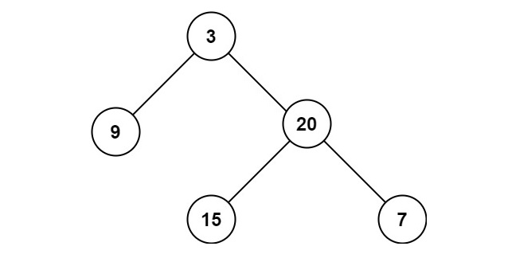

# 104. Maximum Depth of Binary Tree
Tag: easy, binary tree

## Problem statement

Given the `root` of a binary tree, return its maximum depth.

A binary tree's maximum depth is the number of nodes along the longest path from the root node down to the farthest leaf node.

### Example 1

```plain
Input: root = [3,9,20,null,null,15,7]
Output: 3
```
### Example 2
```plain
Input: root = [1,null,2]
Output: 2
``` 

### Constraints

* The number of nodes in the tree is in the range `[0, 10^4]`.
* `-100 <= Node.val <= 100`.

## Solution
You have the following recursive relationship between the `root` and its children.

```plain
maxDepth(root) = max(maxDepth(root->left), maxDepth(root->right))
```

### Code

```cpp
#include <iostream>
struct TreeNode {
    int val;
    TreeNode *left;
    TreeNode *right;
    TreeNode() : val(0), left(nullptr), right(nullptr) {}
    TreeNode(int x) : val(x), left(nullptr), right(nullptr) {}
    TreeNode(int x, TreeNode *left, TreeNode *right) : val(x), left(left), right(right) {}
};

int maxDepth(TreeNode* root) {
    if (root == nullptr) {
        return 0;
    }
    return 1 + std::max(maxDepth(root->left), maxDepth(root->right));
}

int main() {
    TreeNode fifteen(15);
    TreeNode seven(7);
    TreeNode twenty(20, &fifteen, &seven);
    TreeNode nine(9);
    TreeNode three(3, &nine, &twenty);
    std::cout << maxDepth(&three) << std::endl;
    TreeNode two(2);
    TreeNode one(1, nullptr, &two);
    std::cout << maxDepth(&one) << std::endl;
}
```
```plain
Output:
3
2
```
### Complexity
* Runtime: `O(N)`, where `N` is the number of nodes.
* Extra space: `O(1)`.

## References
* [https://leetcode.com/problems/maximum-depth-of-binary-tree/](https://leetcode.com/problems/maximum-depth-of-binary-tree/)