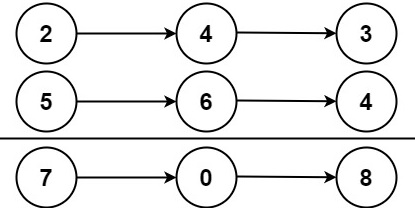

## 2. Add Two Numbers
Tag: medium, linked list

### Problem statement

You are given two non-empty linked lists representing two non-negative integers. The digits are stored in reverse order, and each of their nodes contains a single digit. Add the two numbers and return the sum as a linked list.

You may assume the two numbers do not contain any leading zero, except the number 0 itself.


#### Example 1

```plain
Input: l1 = [2,4,3], l2 = [5,6,4]
Output: [7,0,8]
Explanation: 342 + 465 = 807.
```

#### Example 2
```plain
Input: l1 = [0], l2 = [0]
Output: [0]
```

#### Example 3
```plain
Input: l1 = [9,9,9,9,9,9,9], l2 = [9,9,9,9]
Output: [8,9,9,9,0,0,0,1]
```

#### Constraints

* The number of nodes in each linked list is in the range `[1, 100]`.
* `0 <= Node.val <= 9`.
* It is guaranteed that the list represents a number that does not have leading zeros.

### Solution: Addition With Remember
Perform the school addition calculation and store the result in one of the lists. 

Without loss of generality, let us store the result in `l1`. Then you might need to extend it when `l2` is longer than `l1` and when the result requires one additional node (Example 3).

#### Code
```cpp
#include <iostream>
struct ListNode {
    int val;
    ListNode *next;
    ListNode() : val(0), next(nullptr) {}
    ListNode(int x) : val(x), next(nullptr) {}
    ListNode(int x, ListNode *next) : val(x), next(next) {}
};

ListNode* addTwoNumbers(ListNode* l1, ListNode* l2) {
    ListNode prehead;               // dummy node to hook the head of the list
    ListNode* node = l1;            // store result on l1
    prehead.next = node;
    int sum = 0;
    while (node) {
        if (l1) {
            sum += l1->val;
            l1 = l1->next;
        }
        if (l2) {
            sum += l2->val;
            l2 = l2->next;
        }
        node->val = sum % 10;
        sum /= 10;
        if (!l1) {        // l1 ends
            if (l2) {               // l1 is shorter than l2
                node->next = l2;
            } else if (sum == 1) {  // both l1 and l2 end but the remember is not zero 
                ListNode* newNode = new ListNode(sum);
                node->next = newNode;
            }
        }
        node = node->next;
    }
    return prehead.next;
}
void printResult(ListNode* l) {
    std::cout << "[";
    while (l) {
        std::cout << l->val << ",";
        l = l->next;
    }
    std::cout << "]\n";
}
int main() {
    {
        ListNode three(3);
        ListNode four1(4, &three);
        ListNode two(2, &four1);
        ListNode four2(4);
        ListNode six(6, &four2);
        ListNode five(5, &six);
        printResult(addTwoNumbers(&two, &five));
    }
    {
        ListNode zero1(0);
        ListNode zero2(0);
        printResult(addTwoNumbers(&zero1, &zero2));
    }
    {
        ListNode nine0(9);
        ListNode nine1(9, &nine0);
        ListNode nine2(9, &nine1);
        ListNode nine3(9, &nine2);
        ListNode nine4(9, &nine3);
        ListNode nine5(9, &nine4);
        ListNode nine6(9, &nine5);
        ListNode nine7(9);
        ListNode nine8(9, &nine7);
        ListNode nine9(9, &nine8);
        ListNode nine10(9, &nine9);
        printResult(addTwoNumbers(&nine6, &nine10));
    }
}
```
```plain
Output:
[7,0,8,]
[0,]
[8,9,9,9,0,0,0,1,]
```

#### Complexity
* Runtime: `O(N)`, where `N = max(l1.length, l2.length)`.
* Extra space: `O(1)`.

### References
* [https://leetcode.com/problems/add-two-numbers/](https://leetcode.com/problems/add-two-numbers/)
* [https://www.leetsolve.com/2-add-two-numbers](https://www.leetsolve.com/2-add-two-numbers)
