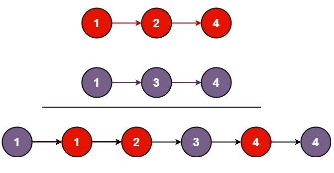

# 21. Merge Two Sorted Lists

## Problem statement

You are given the heads of two sorted linked lists `list1` and `list2`.

Merge the two lists in a one sorted list. The list should be made by splicing together the nodes of the first two lists.

Return the head of the merged linked list.
 

### Example 1

```plain
Input: list1 = [1,2,4], list2 = [1,3,4]
Output: [1,1,2,3,4,4]
```

### Example 2
```plain
Input: list1 = [], list2 = []
Output: []
```

### Example 3

```plain
Input: list1 = [], list2 = [0]
Output: [0]
``` 

### Constraints

* The number of nodes in both lists is in the range `[0, 50]`.
* `-100 <= Node.val <= 100`.
* Both `list1` and `list2` are sorted in non-decreasing order.

## Solution: Constructing a new list

For each pair of nodes between the two lists, pick the node having smaller value to append to the new list.

### Code
```cpp
#include <iostream>
struct ListNode {
    int val;
    ListNode *next;
    ListNode() : val(0), next(nullptr) {}
    ListNode(int x) : val(x), next(nullptr) {}
    ListNode(int x, ListNode *next) : val(x), next(next) {}
};
 
ListNode* mergeTwoLists(ListNode* list1, ListNode* list2) {
    if (list1 == nullptr) {
        return list2;
    } else if (list2 == nullptr) {
        return list1;
    }
    // identify which list is head
    ListNode* head = list1;
    if (list2->val < head->val) {
        head = list2;
        list2 = list2->next;
    } else {
        list1 = list1->next;
    }
    ListNode* node = head;
    while (list1 && list2) {
        if (list1->val < list2->val) {
            node->next = list1;
            list1 = list1->next;
        } else {
            node->next = list2;
            list2 = list2->next;
        }
        node = node->next;
    }
    if (list1 == nullptr) {
        node->next = list2;
    } else {
        node->next = list1;
    }
    return head;
}

void printResult(ListNode* head) {
    std::cout << "[";
    while (head) {
        std::cout << head->val << ",";
        head = head->next;
    }
    std::cout << "]\n";
}
int main() {   
    ListNode four1(4);
    ListNode two1(2, &four1);
    ListNode one1(1, &two1);
    ListNode four2(4);
    ListNode three2(3, &four2);
    ListNode one2(1, &three2);
    auto newOne = mergeTwoLists(&one1, &one2);
    printResult(newOne);

    auto empty = mergeTwoLists(nullptr, nullptr);
    printResult(empty);

    ListNode zero(0);
    auto z = mergeTwoLists(nullptr, &zero);
    printResult(z);
}
```
```plain
Output:
[1,1,2,3,4,4,]
[]
[0,]
```

### Complexity
* Runtime: `O(N)`, where `N = list1.length + list2.length`.
* Extra space: `O(1)`.

## References
* [https://leetcode.com/problems/merge-two-sorted-lists/](https://leetcode.com/problems/merge-two-sorted-lists/)
* [https://www.leetsolve.com/21-merge-two-sorted-lists](https://www.leetsolve.com/21-merge-two-sorted-lists)