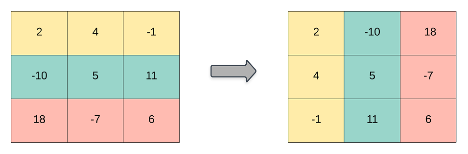

# 867. Transpose Matrix

## Problem statement

Given a 2D integer array `matrix`, return the transpose of `matrix`.

The transpose of a matrix is the matrix flipped over its main diagonal, switching the matrix's row and column indices.



 

### Example 1
```plain
Input: matrix = [[1,2,3],[4,5,6],[7,8,9]]
Output: [[1,4,7],[2,5,8],[3,6,9]]
```

### Example 2
```plain
Input: matrix = [[1,2,3],[4,5,6]]
Output: [[1,4],[2,5],[3,6]]
``` 

### Constraints

* `m == matrix.length`.
* `n == matrix[i].length`.
* `1 <= m, n <= 1000`.
* `1 <= m * n <= 10^5`.
* `-10^9 <= matrix[i][j] <= 10^9`.

## Solution

### Code
```cpp
#include <iostream>
#include <vector>
using namespace std;
vector<vector<int>> transpose(vector<vector<int>>& matrix) {
    vector<vector<int>> mt(matrix[0].size(), vector<int>(matrix.size()));
    for (int i = 0; i < mt.size(); i++) {
        for (int j = 0; j < mt[i].size(); j++) {
            mt[i][j] = matrix[j][i];
        }
    }
    return mt;
}
void printResult(vector<vector<int>>& matrix) {
    cout << "[";
    for (auto row : matrix) {
        cout << "[";
        for (int m : row) {
            cout << m << ",";
        }
        cout << "]";
    }
    cout << "]\n";
}
int main() {
    vector<vector<int>> matrix = {{1,2,3},{4,5,6},{7,8,9}};
    auto result = transpose(matrix);
    printResult(result);
    matrix = {{1,2,3},{4,5,6}};
    result = transpose(matrix);
    printResult(result);
}
```
```plain
Output:
[[1,4,7,][2,5,8,][3,6,9,]]
[[1,4,][2,5,][3,6,]]
```

### Complexity
* Runtime: `O(m*n)`, where `m = matrix.length`, `n = matrix[i].length`.
* Extra space: `O(1)`.

## References

* [https://leetcode.com/problems/transpose-matrix/](https://leetcode.com/problems/transpose-matrix/)
* [https://www.leetsolve.com/867-transpose-matrix/](https://www.leetsolve.com/867-transpose-matrix/)