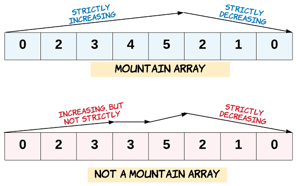

# Valid Mountain Array

## [Problem statement](https://leetcode.com/problems/valid-mountain-array/)

You are given an array of integers `arr`, and your task is to determine whether it is a valid *mountain array*.

A valid *mountain array* must meet the following conditions:

1. The length of `arr` should be greater than or equal to `3`.
2. There should exist an index `i` such that `0 < i < arr.length - 1`, and the elements up to `i` (`arr[0]` to `arr[i]`) should be in strictly ascending order, while the elements starting from `i` (`arr[i]` to `arr[arr.length-1]`) should be in strictly descending order.



### Example 1
```text
Input: arr = [2,1]
Output: false
```

### Example 2
```text
Input: arr = [3,5,5]
Output: false
```

### Example 3
```text
Input: arr = [0,3,2,1]
Output: true
``` 

### Constraints

* `1 <= arr.length <= 10^4`.
* `0 <= arr[i] <= 10^4`.

## Solution

Following the conditions, we have the following implementation.

### Code
```cpp
#include <vector>
#include <iostream>
using namespace std;
bool validMountainArray(vector<int>& arr) {
    if (arr.size() < 3) {
        return false;
    }
    const int N = arr.size() - 1;
    int i = 0;
    while (i < N && arr[i] < arr[i + 1]) {
        i++;
    }
    if (i == 0 || i == N) {
        return false;
    }
    while (i < N && arr[i] > arr[i + 1]) {
        i++;
    }
    return i == N;
}
int main() {
    vector<int> arr{2,1};
    cout << validMountainArray(arr) << endl;
    arr = {3,5,5};   
    cout << validMountainArray(arr) << endl;
    arr = {0,3,2,1};   
    cout << validMountainArray(arr) << endl;
    arr = {9,8,7,6,5,4,3,2,1,0};
    cout << validMountainArray(arr) << endl;
}
```
```text
Output:
0
0
1
0
```

### Code explanation

1. The code begins by checking if the length of the input vector `arr` is less than 3. If it's less than 3, it's impossible for `arr` to represent a valid mountain array because such an array must have at least three elements (two slopes and a peak). In this case, the function immediately returns `false`.

2. It defines a constant `N` to store the maximum index in the input vector `arr`. `N` is set to `arr.size() - 1` because array indices start from 0.

3. The first loop starts from `i = 0`. This variable will be used to traverse the array and find the peak of the mountain. The loop iterates through the array as long as it hasn't reached the end of the array and the elements at `i` and `i + 1` are in strictly increasing order (the slope is going upwards). This loop moves `i` to the right until it reaches the peak of the mountain.

4. After the first loop, the code checks whether `i` is either 0 (meaning we didn't find an increasing slope to the left) or `i` is equal to `N` (meaning we didn't find a decreasing slope to the right). In either of these cases, it's not a valid mountain array, so the function returns `false`.

5. After finding the peak in the first loop, the second loop iterates through the array as long as `i` is less than `N` and the elements at `i` and `i + 1` are in strictly decreasing order (the slope is going downwards). This loop checks the right slope of the mountain.

6. Finally, after the second loop, the code checks if `i` is equal to `N`. If this condition is true, it means we've successfully traversed both slopes of the mountain, and the function returns `true`, indicating that `arr` represents a valid mountain array.

In summary, this code iteratively checks for the two slopes of a mountain array, ensuring that the elements to the left are in strictly increasing order and the elements to the right are in strictly decreasing order. If both conditions are met, the function returns `true`, indicating that the input array is a valid mountain array; otherwise, it returns `false`.

### Complexity
* Runtime: $O(N)$, where $N$ is `arr.length`.
* Extra space: $O(1)$.
