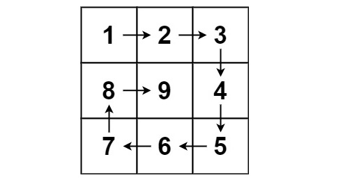

# Spiral Matrix II
% Medium 

## Problem statement

[^url]Given a positive integer `n`, generate an `n x n` matrix filled with elements from `1` to `n^2` in spiral order.

[^url]: https://leetcode.com/problems/spiral-matrix-ii/

### Example 1



```plain
Input: n = 3
Output: [[1,2,3],[8,9,4],[7,6,5]]
```
### Example 2
```plain
Input: n = 1
Output: [[1]]
``` 

### Constraints

* `1 <= n <= 20`.

## Solution 

1. Starting from the top left of the matrix.
2. Going along the spiral direction. 
3. Put the value to the matrix, starting from `1`.

### Code

```cpp
#include <vector>
#include <iostream>
using namespace std;
enum Direction {RIGHT, DOWN, LEFT, UP};
vector<vector<int>> generateMatrix(int n) {
    vector<vector<int>> m(n, vector<int>(n));
    int bottom = n - 1;
    int right = n - 1;
    int top = 0;
    int left = 0;
    int row = 0;
    int col = 0;
    Direction d = RIGHT;
    int a = 1;
    while (top <= bottom && left <= right) {
        m[row][col] = a++;
        switch (d) {
            case RIGHT: if (col == right) {
                            top++;
                            d = DOWN;
                            row++;
                        } else {
                            col++;
                        }
                        break;
            case DOWN:  if (row == bottom) {
                            right--;
                            d = LEFT;
                            col--;
                        } else {
                            row++;
                        }
                        break;
            case LEFT:  if (col == left) {
                            bottom--;
                            d = UP;
                            row--;
                        } else {
                            col--;
                        }
                        break;
            case UP:    if (row == top) {
                            left++;
                            d = RIGHT;
                            col++;
                        } else {
                            row--;
                        }
                        break;
        }
    }
    return m;
}
void printResult(const vector<vector<int>>& m) {
    cout << "[";
    for (auto& r : m) {
        cout << "[";
        for (int a : r) {
            cout << a << ",";
        }
        cout << "]";
    }
    cout << "]\n";
}
int main() {
    auto m = generateMatrix(3);
    printResult(m);
    m = generateMatrix(1);
    printResult(m);
}
```
```plain
Output:
[[1,2,3,][8,9,4,][7,6,5,]]
[[1,]]
```

This solution uses a `Direction` `enum` and boundary variables to iteratively fill the matrix in a spiral pattern. Updating the direction of movement based on the current position and boundaries efficiently populates the matrix with sequential values, traversing in a clockwise direction from the outer layer to the inner layer.

### Complexity

* Runtime: `O(n^2)`, where `n x n` is the size of the matrix.
* Extra space: `O(1)`.

## Key Takeaway

Enumerating directions with an enum (like `Direction`) can enhance code readability and maintainability, especially in algorithms involving traversal or movement. It aids in clearly defining and referencing the possible directions within the problem domain.

## Exercise
- Spiral Matrix[^ex].

[^ex]: https://leetcode.com/problems/spiral-matrix/