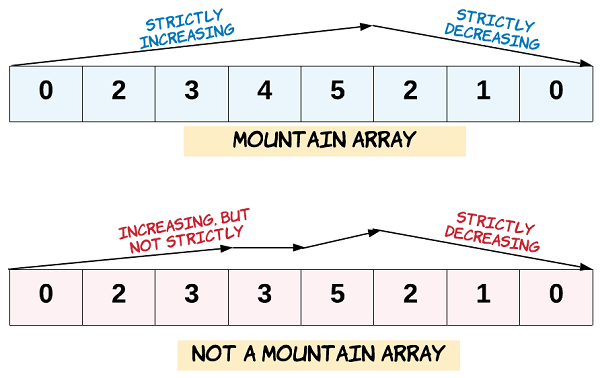

# Valid Mountain Array
% Easy  
## Problem statement

[^url]You are given an array of integers `arr`, and your task is to determine whether it is a valid *mountain array*.

A valid *mountain array* must meet the following conditions:

1. The length of `arr` should be greater than or equal to `3`.
2. There should exist an index `i` such that `0 < i < arr.length - 1`, and the elements up to `i` (`arr[0]` to `arr[i]`) should be in strictly ascending order, while the elements starting from `i` (`arr[i]` to `arr[arr.length-1]`) should be in strictly descending order.



[^url]: https://leetcode.com/problems/valid-mountain-array/
### Example 1
```text
Input: arr = [2,1]
Output: false
```

### Example 2
```text
Input: arr = [3,5,5]
Output: false
```

### Example 3
```text
Input: arr = [0,3,2,1]
Output: true
``` 

### Constraints

* `1 <= arr.length <= 10^4`.
* `0 <= arr[i] <= 10^4`.

## Solution

Following the conditions, we have the following implementation.

### Code
```cpp
#include <vector>
#include <iostream>
using namespace std;
bool validMountainArray(vector<int>& arr) {
    if (arr.size() < 3) {
        return false;
    }
    const int N = arr.size() - 1;
    int i = 0;
    while (i < N && arr[i] < arr[i + 1]) {
        i++;
    }
    // condition: 0 < i < N - 1
    if (i == 0 || i == N) {
        return false;
    }
    while (i < N && arr[i] > arr[i + 1]) {
        i++;
    }
    return i == N;
}
int main() {
    vector<int> arr{2,1};
    cout << validMountainArray(arr) << endl;
    arr = {3,5,5};   
    cout << validMountainArray(arr) << endl;
    arr = {0,3,2,1};   
    cout << validMountainArray(arr) << endl;
    arr = {9,8,7,6,5,4,3,2,1,0};
    cout << validMountainArray(arr) << endl;
}
```
```text
Output:
0
0
1
0
```

This solution iteratively checks for the two slopes of a mountain array, ensuring that the elements to the left are strictly increasing and the elements to the right are strictly decreasing. If both conditions are met, the function returns `true`, indicating that the input array is a valid mountain array; otherwise, it returns `false`.

### Complexity
* Runtime: `O(N)`, where `N = arr.length`.
* Extra space: `O(1)`.

## Exercise
- [Beautiful Towers I](https://leetcode.com/problems/beautiful-towers-i/)