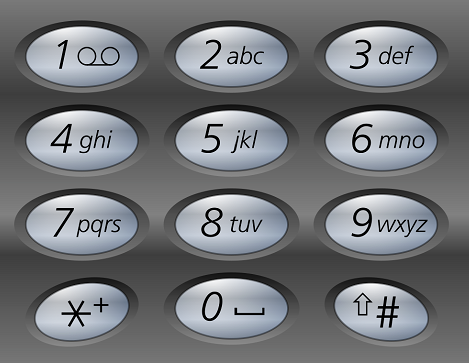

# Letter Combinations of a Phone Number

## Problem statement

[^url]Given a string containing digits from `2-9` inclusive, return all possible letter combinations that the number could represent. Return the answer in any order.

[^url]: https://leetcode.com/problems/letter-combinations-of-a-phone-number/

A mapping of digits to letters (just like on the telephone buttons) is given below. Note that `1` does not map to any letters.




### Example 1
```text
Input: digits = "23"
Output: ["ad","ae","af","bd","be","bf","cd","ce","cf"]
```

### Example 2
```text
Input: digits = ""
Output: []
```

### Example 3
```text
Input: digits = "2"
Output: ["a","b","c"]
``` 

### Constraints

* `0 <= digits.length <= 4`.
* `digits[i]` is a digit in the range `['2', '9']`.

## Solution: Recursive

If you know the combinations `result` of a string `digits`, what is the result of extending it one more digit?

**Answer**: The new result is constructed by adding each letter of the mapping of the new digit to each string of the `result`. 

### Example 1 and 3
Assume you have computed the result of `digits = "2"`, which is `["a","b","c"]`. 

To compute the result of `digits = "23"`, you add each letter of the mapping `'3' -> {'d', 'e', 'f'}` to each string `"a", "b", "c"`. 

You get the new result `["ad","ae","af","bd","be","bf","cd","ce","cf"]`.

### Code
```cpp
#include <vector>
#include <iostream>
#include <unordered_map>
using namespace std;
const unordered_map<char, vector<char> > m{{'2', {'a', 'b', 'c'}},
                                        {'3', {'d', 'e', 'f'}},
                                        {'4', {'g', 'h', 'i'}},
                                        {'5', {'j', 'k', 'l'}},
                                        {'6', {'m', 'n', 'o'}},
                                        {'7', {'p', 'q', 'r', 's'}},
                                        {'8', {'t', 'u', 'v'}},
                                        {'9', {'w', 'x', 'y', 'z'}}};

void combination(const string_view& digits, int i, vector<string>& result) {
    if (i >= digits.length()) {
        return;
    }
    if (result.empty()) {
        result = {""};
    }
    vector<string> newResult;
    for (string& s : result) {
        for (auto& c : m.at(digits[i])) {
            newResult.push_back(s + c);
        }
    }
    result.swap(newResult);
    combination(digits, i + 1, result);
}
vector<string> letterCombinations(string digits) {
    vector<string> result;
    combination(digits, 0, result);
    return result;
}
void printResult(vector<string>& result) {
    cout << "[";
    for (string& s : result) {
        cout << s << ",";
    }
    cout << "]\n";
}
int main() {
    vector<string> result = letterCombinations("23");
    printResult(result);
    result = letterCombinations("");
    printResult(result);
    result = letterCombinations("2");
    printResult(result);
}
```
```text
Output:
[ad,ae,af,bd,be,bf,cd,ce,cf,]
[]
[a,b,c,]
```

### Complexity
* Runtime: `O(3^N)`, where `N = digits.length`. In this problem, `N` is very small (`N <= 4`).
* Extra space: `O(1)` (the small map).

## Implementation notes
You can use the assignment operator `'='` for `result.swap(newResult)`, i.e. `result = newResult`. 

But this assignment allocates additional memory for a copy of `newResult` before assigning it to `result`.

The `std::swap()`[^swap] algorithm avoids such copying by using {index}`std::move()`[^move]. It exchanges the contents of each other without allocating additional memory.


[^swap]: https://en.cppreference.com/w/cpp/string/basic_string/swap

[^move]: https://en.cppreference.com/w/cpp/utility/move