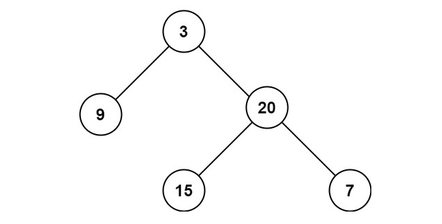

# Maximum Depth of Binary Tree

## [Problem statement](https://leetcode.com/problems/maximum-depth-of-binary-tree/)

Given the `root` of a binary tree, return its maximum depth.

A binary tree's maximum depth is the number of nodes along the longest path from the root node down to the farthest leaf node.

### Example 1

```text
Input: root = [3,9,20,null,null,15,7]
Output: 3
```
### Example 2
```text
Input: root = [1,null,2]
Output: 2
``` 

### Constraints

* The number of nodes in the tree is in the range `[0, 10^4]`.
* `-100 <= Node.val <= 100`.

## Solution
You have the following recursive relationship between the `root` and its children.

```text
maxDepth(root) = max(maxDepth(root->left), maxDepth(root->right))
```

### Code

```cpp
#include <iostream>
using namespace std;
struct TreeNode {
    int val;
    TreeNode *left;
    TreeNode *right;
    TreeNode() 
    : val(0), left(nullptr), right(nullptr) {        
    }
    TreeNode(int x) 
    : val(x), left(nullptr), right(nullptr) {        
    }
    TreeNode(int x, TreeNode *left, TreeNode *right)
    : val(x), left(left), right(right) {        
    }
};

int maxDepth(TreeNode* root) {
    if (root == nullptr) {
        return 0;
    }
    return 1 + max(maxDepth(root->left), maxDepth(root->right));
}
int main() {
    TreeNode fifteen(15);
    TreeNode seven(7);
    TreeNode twenty(20, &fifteen, &seven);
    TreeNode nine(9);
    TreeNode three(3, &nine, &twenty);
    cout << maxDepth(&three) << endl;
    TreeNode two(2);
    TreeNode one(1, nullptr, &two);
    cout << maxDepth(&one) << endl;
}
```
```text
Output:
3
2
```

### Code explanation

1. At the beginning of the function, there is a base case check. This condition checks if the current node, represented by `root`, is a null pointer. If it is, it means that the tree is empty (or a subtree is empty), and the depth at this point is zero. So, the function returns `0` to indicate that the depth of the current subtree is zero.

2. If the current node is not null (i.e., it's a valid node in the tree), the code proceeds to calculate the maximum depth of the left and right subtrees.

3. `maxDepth(root->left)` and `maxDepth(root->right)` are recursive function calls that calculate the maximum depth of the left and right subtrees, respectively.

4. The `std::max` function is used to find the maximum depth among the left and right subtrees. Adding `1` to this maximum depth represents the depth of the current node in the tree.

5. This recursive calculation repeats for each node in the tree until it reaches the base case of a null node, and the recursion unwinds, returning depth values for each subtree.

6. Ultimately, the function returns the maximum depth of the entire binary tree rooted at the given `root` node.


### Complexity

This solution uses a recursive algorithm to calculate the maximum depth of a binary tree. It starts from the root node and recursively calculates the maximum depth of the left and right subtrees, returning the maximum depth among them. This process continues until it reaches the leaf nodes of the tree. 

* Runtime: `O(n)`, where `n` is the number of nodes.
* Extra space: `O(h)`, where `h` is the height of the tree.


