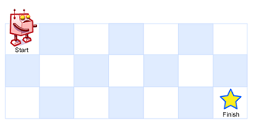

# Unique Paths

## [Problem statement](https://leetcode.com/problems/unique-paths/)

A robot starts at the top-left corner of a grid with dimensions `m x n`. It can move either down or right at each step. The robot's goal is to reach the bottom-right corner of the grid.

The problem is to determine the number of unique paths the robot can take to reach the bottom-right corner.

### Example 1



```text
Input: m = 3, n = 7
Output: 28
```

### Example 2

```text
Input: m = 3, n = 2
Output: 3
Explanation:
From the top-left corner, there are a total of 3 ways to reach the bottom-right corner:
1. Right -> Down -> Down
2. Down -> Down -> Right
3. Down -> Right -> Down
```

### Example 3

```text
Input: m = 7, n = 3
Output: 28
```

### Example 4

```text
Input: m = 3, n = 3
Output: 6
```
 
### Constraints

* `1 <= m, n <= 100`.
* It's guaranteed that the answer will be less than or equal to `2*10^9`.

## Solution 1: Recursive

At each point, the robot has two ways of moving: right or down. Let `P(m,n)` is the wanted result. Then you have a recursive relationship:

```text
P(m,n) = P(m-1, n) + P(m, n-1)
```

If the grid has only one row or only one column, then there is only one possible path.

```text
P(1, n) = P(m, 1) = 1.
```

We have a recursive implementation.

### Code

```cpp
#include <iostream>
#include <vector>
using namespace std;
int uniquePaths(int m, int n) {
    if (m == 1 || n == 1) {
        return 1;
    }
    return uniquePaths(m - 1, n) + uniquePaths(m, n - 1);
}
int main() {
    std::cout << uniquePaths(3,7) << std::endl;
    std::cout << uniquePaths(7,3) << std::endl;
    std::cout << uniquePaths(3,2) << std::endl;
    std::cout << uniquePaths(3,3) << std::endl;
}
```

```text
Output:
28
28
3
6
```

### Complexity
* Runtime: $O(2^m + 2^n)$, where $m \times n$ is the size of the grid.
* Extra space: $O(2^m + 2^n)$.

## Solution 2: Dynamic programming
The recursive implementation repeats a lot of computations.

For example, `uniquePaths(2,2)` was recomputed in both `uniquePaths(2,3)` and `uniquePaths(3,2)` when you compute `uniquePaths(3,3)`.

One way of storing what has been computed is by using dynamic programming.

### Code

```cpp
#include <iostream>
#include <vector>
using namespace std;
int uniquePaths(int m, int n) {
    vector<vector<int> > dp(m, vector<int>(n,1));
    for (int i = 1; i < m; i++) {
        for (int j = 1; j < n; j++) {
            dp[i][j] = dp[i - 1][j] + dp[i][j - 1];
        }
    }
    return dp[m - 1][n - 1];
}
int main() {
    std::cout << uniquePaths(3,7) << std::endl;
    std::cout << uniquePaths(7,3) << std::endl;
    std::cout << uniquePaths(3,2) << std::endl;
    std::cout << uniquePaths(3,3) << std::endl;
}
```

```text
Output:
28
28
3
6
```
### Complexity

* Runtime: $O(mn)$, where $m \times n$ is the size of the grid.
* Extra space: $O(mn)$.

## Solution 3: Reduced dynamic programming
You can rephrase the relationship inside the loop like this:

> "new value" = "old value" + "previous value";

Then you do not have to store all values of all rows.

### Code
```cpp
#include <iostream>
#include <vector>
using namespace std;
int uniquePaths(int m, int n) {
    vector<int> dp(n, 1);
    for (int i = 1; i < m; i++) {
        for (int j = 1; j < n; j++) {
            dp[j] += dp[j - 1];
        }
    }
    return dp[n - 1];
}
int main() {
    std::cout << uniquePaths(3,7) << std::endl;
    std::cout << uniquePaths(7,3) << std::endl;
    std::cout << uniquePaths(3,2) << std::endl;
    std::cout << uniquePaths(3,3) << std::endl;
}
```

```text
Output:
28
28
3
6
```

### Complexity
* Runtime $O(mn)$.
* Memory $O(n)$.

## Final thought
I am wondering if there is some mathematics behind this problem. Please share your finding if you find a formula for the solution to this problem.


