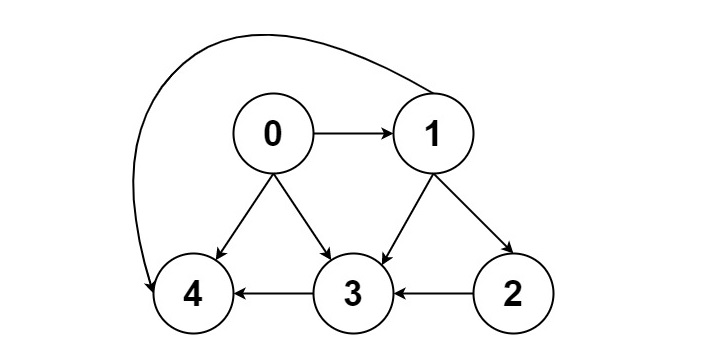

# All Paths From Source to Target

## [Problem statement](https://leetcode.com/problems/all-paths-from-source-to-target/)
Given a *directed acyclic graph* (DAG) of `n` nodes labeled from `0` to `n - 1`, find all possible paths from node `0` to node `n - 1` and return them in any order.

The graph is given as follows: `graph[i]` is a list of all nodes you can visit from node `i` (i.e., there is a directed edge from node `i` to node `graph[i][j]`).

### Example 1

```text
Input: graph = [[1,2],[3],[3],[]]
Output: [[0,1,3],[0,2,3]]
Explanation: There are two paths: `0 -> 1 -> 3` and `0 -> 2 -> 3`.
```

### Example 2

```text
Input: graph = [[4,3,1],[3,2,4],[3],[4],[]]
Output: [[0,4],[0,3,4],[0,1,3,4],[0,1,2,3,4],[0,1,4]]
```

### Example 3
```text
Input: graph = [[1],[]]
Output: [[0,1]]
```

### Example 4
```text
Input: graph = [[1,2,3],[2],[3],[]]
Output: [[0,1,2,3],[0,2,3],[0,3]]
```

### Example 5
```text
Input: graph = [[1,3],[2],[3],[]]
Output: [[0,1,2,3],[0,3]]
```
 
### Constraints

* `n == graph.length`.
* `2 <= n <= 15`.
* `0 <= graph[i][j] < n`.
* `graph[i][j] != i` (i.e., there will be no self-loops).
* All the elements of `graph[i]` are unique.
* The input graph is guaranteed to be a DAG.

## Solution: Depth-first search (DFS)

This problem is exactly the [Depth-first search algorithm](https://en.wikipedia.org/wiki/Depth-first_search).

### Code
```cpp
#include <vector>
#include <iostream>
using namespace std;
void DFS(vector<vector<int>>& graph, vector<vector<int>>& paths, vector<int>& path) 
{
    for (auto& node : graph.at(path.back())) 
    {
        path.push_back(node);
        if (node == graph.size() - 1) 
        {
            paths.push_back(path);
            path.pop_back();
        } 
        else 
        {
            DFS(graph, paths, path);
        }
    }
    path.pop_back();
}
vector<vector<int>> allPathsSourceTarget(vector<vector<int>>& graph) 
{
    vector<vector<int>> paths;
    vector<int> path = {0};
    DFS(graph, paths, path);
    return paths;
}
void printPaths(vector<vector<int>>& paths) 
{
    cout << "[";
    for (auto& p : paths) 
    {
        cout << "[";
        for (auto& node : p) 
        {
            cout << node << ",";
        }
        cout << "],";
    }
    cout << "]\n";
}
int main() 
{
    vector<vector<int>> graph = {{1,2},{3},{3},{}};
    auto paths = allPathsSourceTarget(graph);
    printPaths(paths);
    graph = {{4,3,1},{3,2,4},{3},{4},{}};
    paths = allPathsSourceTarget(graph);
    printPaths(paths); 
}
```
```text
Output:
[[0,1,3,],[0,2,3,],]
[[0,4,],[0,3,4,],[0,1,3,4,],[0,1,2,3,4,],[0,1,4,],]
```

### Code explanation

This code performs a Depth-First Search (DFS) to find all possible paths from the source node (0) to the target node (`graph.size() - 1`) in a given directed graph represented as an adjacency list. 

The `DFS` function explores the graph starting from the current node, and if it reaches the target node, it adds the path to the `paths` vector. Otherwise, it continues the DFS exploration from the neighboring nodes. 

The `allPathsSourceTarget` function initializes the `paths` vector and a `path` vector that starts at the source node (0). It then calls the `DFS` function to traverse the graph, and once the traversal is complete, it returns the `paths` vector containing all possible paths from the source to the target node.

### Complexity

The **runtime complexity** depends on a few factors:

- Number of nodes (`N`) and edges (`E`) in the graph.
- Number of paths between the two nodes.

In the worst case, DFS will explore all nodes in the graph. This happens when:

- The graph is dense (high `E` compared to `N`).
- There are many paths between the two nodes.

To find **all** paths between two nodes, DFS will have to explore the entire search space. So in the worst case, the complexity is `O(N + E)`.

* Runtime: `O(N + E)`, where `N = graph.length` and `E` is the number of the graph's edges.
* Extra space: `O(N)` (the vector `path`).


