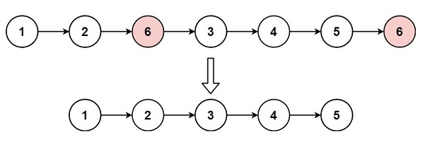

# Remove Linked List Elements

## [Problem statement](https://leetcode.com/problems/remove-linked-list-elements/)

You are given the starting node, `head`, of a linked list, and an integer `val`. Your task is to eliminate all nodes from the linked list that have a value equal to `val`. After removing these nodes, return the new starting node of the modified linked list.

### Example 1



```text
Input: head = [1,2,6,3,4,5,6], val = 6
Output: [1,2,3,4,5]
```

### Example 2
```text
Input: head = [], val = 1
Output: []
```

### Example 3
```text
Input: head = [7,7,7,7], val = 7
Output: []
```
 
### Constraints
* The number of nodes in the list is in the range `[0, 10^4]`.
* `1 <= Node.val <= 50`.
* `0 <= val <= 50`.

### Linked list data structure
```cpp
struct ListNode {
    int val;
    ListNode *next;
    ListNode() : val(0), next(nullptr) {}
    ListNode(int x) : val(x), next(nullptr) {}
    ListNode(int x, ListNode *next) : val(x), next(next) {}
};
```

## Solution 1: Consider the special case for head
Removing a node `A` in a linked list means instead of connecting the previous node `A.pre` to `A`, you connect `A.pre` to `A.next`.

### Code
```cpp
#include <iostream>
struct ListNode {
    int val;
    ListNode *next;
    ListNode() : val(0), next(nullptr) {}
    ListNode(int x) : val(x), next(nullptr) {}
    ListNode(int x, ListNode *next) : val(x), next(next) {}
};
ListNode* removeElements(ListNode* head, int val) {
    while (head && head->val == val) {
        head = head->next;
    }
    if (head == nullptr) return nullptr;
    ListNode* pre = head;
    while (pre->next) {
        if (pre->next->val == val) {
            pre->next = pre->next->next;
        } else {
            pre = pre->next;
        }
    }
    return head;
}
```

### Code explanation

1. The first loop removes consecutive nodes with the specified `val` at the beginning of the linked list.

2. After the first loop, if `head` becomes `nullptr`, it means that all nodes with the specified `val` have been removed from the beginning of the linked list. In this case, the function returns `nullptr` to indicate that the linked list is now empty.

3. If `head` is not `nullptr` (indicating that there are still nodes in the linked list after removal of consecutive nodes with the specified `val` at the beginning), the code initializes a pointer `pre` to `head`. This pointer will be used to traverse the remaining nodes in the linked list.

4. The second loop checks if the `val` of the next node (`pre->next->val`) matches the specified `val`. If it does, the code removes the node with the specified `val` by updating `pre->next` to point to the node after the next node (`pre->next->next`). This effectively skips the node with the specified `val`. If the `val` of the next node does not match, the `pre` pointer is simply moved to the next node in the linked list.

5. Finally, the function returns `head`, which now points to the modified linked list with all nodes containing the specified `val` removed.

In summary, this code efficiently removes nodes with a specified value `val` from a linked list by using two pointers (`head` and `pre`) to traverse the list and update the `next` pointers to bypass nodes with the specified value. 

### Complexity
* Runtime: $O(N)$, where $N$ is the number of nodes.
* Memory: $O(1)$.

## Solution 2: Create a previous dummy node for head
`head` has no `pre`. You can create a dummy node for `head.pre`. 

### Code
```cpp
ListNode* removeElements(ListNode* head, int val) {
    ListNode preHead(2023, head);
    ListNode* pre = &preHead;
    while (pre->next) {
        if (pre->next->val == val) {
            pre->next = pre->next->next;
        } else {
            pre = pre->next;
        }
    }
    return preHead.next;
}
```
### Code explanation

The code creates a `preHead` node with a value of `2023` (an arbitrary value) and sets its `next` pointer to point to the original `head` of the linked list. 

The purpose of this `preHead` node is to serve as the dummy or sentinel node at the beginning of the linked list. Having a `preHead` node simplifies the code because it eliminates the need to handle the special case of removing nodes from the beginning of the list separately.

The remaining code is the same.

### Complexity
* Runtime: $O(N)$, where $N$ is the number of nodes.
* Memory: $O(1)$.

### Attention!
Depending on your real situation, in practice, you might need to deallocate memory for the removed nodes; especially when they were allocated by the `new` operator.

```cpp
ListNode* removeElements(ListNode* head, int val) {
    ListNode preHead(2022, head);
    ListNode* pre = &preHead;
    while (pre->next) {
        if (pre->next->val == val) {
            ListNode* node = pre->next;
            pre->next = node->next;
            delete node;
        } else {
            pre = pre->next;
        }
    }
    return preHead.next;
}
```

## Key takeaway
* In some linked list problems where `head` needs to be treated as a special case, you can create a previous dummy node for it to adapt the general algorithm.
* Be careful with memory leak when removing nodes of the linked list containing pointers. 


