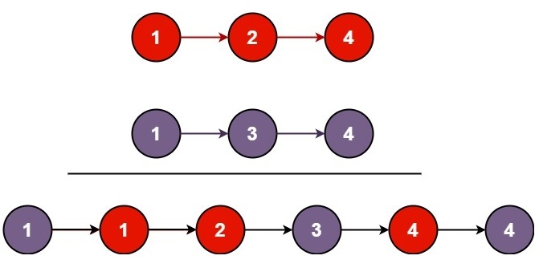

# Merge Two Sorted Lists

## [Problem statement](https://leetcode.com/problems/merge-two-sorted-lists/)

Given the starting nodes of two sorted linked lists, `list1` and `list2`, your task is to combine these lists into a single sorted linked list. 

This merged list should be created by connecting the nodes from both `list1` and `list2`. Finally, you should return the starting node of the resulting merged linked list.

### Example 1

```text
Input: list1 = [1,2,4], list2 = [1,3,4]
Output: [1,1,2,3,4,4]
```

### Example 2
```text
Input: list1 = [], list2 = []
Output: []
```

### Example 3

```text
Input: list1 = [], list2 = [0]
Output: [0]
``` 

### Constraints

* The number of nodes in both lists is in the range `[0, 50]`.
* `-100 <= Node.val <= 100`.
* Both `list1` and `list2` are sorted in non-decreasing order.

## Solution: Constructing a new list

For each pair of nodes between the two lists, pick the node having smaller value to append to the new list.

### Code
```cpp
struct ListNode {
    int val;
    ListNode *next;
    ListNode() : val(0), next(nullptr) {}
    ListNode(int x) : val(x), next(nullptr) {}
    ListNode(int x, ListNode *next) : val(x), next(next) {}
};
 
ListNode* mergeTwoLists(ListNode* list1, ListNode* list2) {
    if (list1 == nullptr) {
        return list2;
    } else if (list2 == nullptr) {
        return list1;
    }
    // identify which list is head
    ListNode* head = list1;
    if (list2->val < head->val) {
        head = list2;
        list2 = list2->next;
    } else {
        list1 = list1->next;
    }
    ListNode* node = head;
    while (list1 && list2) {
        if (list1->val < list2->val) {
            node->next = list1;
            list1 = list1->next;
        } else {
            node->next = list2;
            list2 = list2->next;
        }
        node = node->next;
    }
    if (list1 == nullptr) {
        node->next = list2;
    } else {
        node->next = list1;
    }
    return head;
}
```

### Code explanation

1. The function begins with two base cases to handle situations where one of the input lists is empty:
   - If `list1` is empty (i.e., `list1` is `nullptr`), the function simply returns `list2`. There is no need to merge anything because `list1` is empty.
   - Similarly, if `list2` is empty (i.e., `list2` is `nullptr`), the function returns `list1`.

2. A `head` pointer will be used to keep track of the merged list. The code determines which of `list1` and `list2` should be the head of the merged list. It does this by comparing the values of the first nodes in `list1` and `list2`:
   - If the value of the first node in `list2` is less than the value of the first node in `list1`, it means that `list2` should be the new head of the merged list. The code updates the `head` pointer to point to `list2`, and it advances the `list2` pointer to the next node.
   - If the value of the first node in `list1` is less than or equal to the value in `list2`, `list1` should be the new head. The code advances the `list1` pointer to the next node.

3. The main merging process is performed using a `while` loop that continues as long as both `list1` and `list2` are not empty:
   - Inside the loop, the code compares the values of the first nodes in `list1` and `list2`:
     - If the value in `list1` is smaller, the code connects the current node pointed to by `node` to the node in `list1`, and advances `list1` to its next node.
     - If the value in `list2` is smaller or equal, the code connects the current node pointed to by `node` to the node in `list2`, and advances `list2` to its next node.
   - After connecting a node, the `node` pointer is moved to the newly connected node.

4. After the `while` loop completes, one of the input lists may still have remaining elements. To ensure that all elements are included in the merged list, the code appends the remaining nodes from either `list1` or `list2` (whichever is not empty) to the end of the merged list.

5. Finally, the function returns `head`, which points to the head of the merged sorted linked list.

### Complexity
* Runtime: $O(N)$, where $N$ is `list1.length + list2.length`.
* Extra space: $O(1)$.


