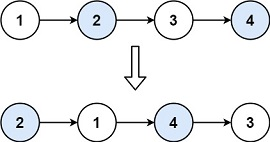
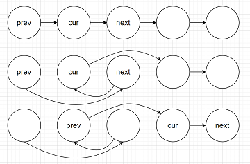

# Swap Nodes in Pairs

## [Problem statement](https://leetcode.com/problems/swap-nodes-in-pairs/)

You are provided with a linked list. Your goal is to exchange every two adjacent nodes in the list and then return the head of the modified list. 

You must solve this problem without altering the values within the nodes; you should only modify the arrangement of the nodes themselves. 

### Example 1

```text
Input: head = [1,2,3,4]
Output: [2,1,4,3]
```

### Example 2
```text
Input: head = []
Output: []
```
### Example 3
```text
Input: head = [1]
Output: [1]
``` 

### Constraints

* The number of nodes in the list is in the range `[0, 100]`.
* `0 <= Node.val <= 100`.

## Solution

Draw a picture of the swapping to identify the correct order of the update.



Denote `(cur, next)` the pair of nodes you want to swap and `prev` be the previous node that links to `cur`. Here are the steps you need to perform for the swapping.
1. Update the links between nodes.
2. Go to the next pair. 

### Code
```cpp
struct ListNode {
    int val;
    ListNode *next;
    ListNode() : val(0), next(nullptr) {}
    ListNode(int x) : val(x), next(nullptr) {}
    ListNode(int x, ListNode *next) : val(x), next(next) {}
};
ListNode* swapPairs(ListNode* head) {
    if (head == nullptr || head->next == nullptr) {
        return head;
    }
    ListNode* preNode = nullptr;
    ListNode* curNode = head; 
    ListNode* nextNode = head->next;  
    head = nextNode;
    while (curNode != nullptr && nextNode != nullptr) {
        curNode->next = nextNode->next;
        nextNode->next = curNode;
        if (preNode) {
            preNode->next = nextNode;
        }
        preNode = curNode;
        curNode = curNode->next;       
        if (curNode) {
            nextNode = curNode->next;
        }
    }
    return head;
}
```

### Code explanation

1. The function begins with a base case to handle situations where the linked list is either empty or contains only one node:
   - If `head` is `nullptr` (indicating an empty list) or `head->next` is `nullptr` (indicating only one node in the list), there is nothing to swap, so the function immediately returns `head` without any modifications.

2. Three pointers are initialized to manage the swapping process:
   - `preNode` keeps track of the previous node to connect the swapped nodes correctly.
   - `curNode` initially points to the first node to be swapped.
   - `nextNode` initially points to the second node to be swapped.

3. The code updates the `head` pointer to point to the second node in the original list. This step is crucial because after the swap, the second node will become the new head of the list.

4. The main swapping process is performed using a `while` loop. Inside the loop, the code performs the following steps for each pair of nodes:
    - `curNode->next = nextNode->next;`: This updates the `next` pointer of `curNode` to point to the node after `nextNode`. This effectively removes `nextNode` from the list and connects `curNode` to the following node.
    - `nextNode->next = curNode;`: This updates the `next` pointer of `nextNode` to point to `curNode`. This step swaps the positions of `curNode` and `nextNode` in the list.
    - If `preNode` is not `nullptr` (indicating that we are not at the beginning of the list), it updates the `next` pointer of `preNode` to point to `nextNode`. This step connects the previous pair (if any) to the newly swapped pair.
    - The `preNode` pointer is updated to `curNode` because it will be used in the next iteration to connect the next pair.

5. After the loop completes, the linked list has been modified by swapping adjacent nodes.

6. Finally, the function returns `head`, which now points to the head of the linked list with adjacent nodes swapped.

### Complexity
* Runtime: $O(N)$, where $N$ is the number of nodes.
* Extra space: $O(1)$.


