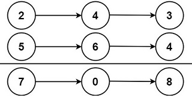

# Add Two Numbers

## [Problem statement](https://leetcode.com/problems/add-two-numbers/)


You have two linked lists that represent non-negative integers. The digits of these numbers are stored in reverse order, with each node containing a single digit. 

Your task is to add the two numbers represented by these linked lists and return the result as a new linked list. 

You can assume that the two numbers don't have leading zeros, except for the number 0 itself.


### Example 1

```text
Input: l1 = [2,4,3], l2 = [5,6,4]
Output: [7,0,8]
Explanation: 342 + 465 = 807.
```

### Example 2
```text
Input: l1 = [0], l2 = [0]
Output: [0]
```

### Example 3
```text
Input: l1 = [9,9,9,9,9,9,9], l2 = [9,9,9,9]
Output: [8,9,9,9,0,0,0,1]
```

### Constraints

* The number of nodes in each linked list is in the range `[1, 100]`.
* `0 <= Node.val <= 9`.
* It is guaranteed that the list represents a number that does not have leading zeros.

## Solution: Addition With Remember
Perform the school addition calculation and store the result in one of the lists. 

Without loss of generality, let us store the result in `l1`. Then you might need to extend it when `l2` is longer than `l1` and when the result requires one additional node (Example 3).

### Code
```cpp
#include <iostream>
struct ListNode {
    int val;
    ListNode *next;
    ListNode() : val(0), next(nullptr) {}
    ListNode(int x) : val(x), next(nullptr) {}
    ListNode(int x, ListNode *next) : val(x), next(next) {}
};

ListNode* addTwoNumbers(ListNode* l1, ListNode* l2) {
    ListNode prehead;     // dummy node to hook the head of the list
    ListNode* node = l1;  // store result on l1
    prehead.next = node;
    int sum = 0;
    while (node) {
        if (l1) {
            sum += l1->val;
            l1 = l1->next;
        }
        if (l2) {
            sum += l2->val;
            l2 = l2->next;
        }
        node->val = sum % 10;
        sum /= 10;
        if (!l1) {      // l1 ends        
            if (l2) {   // l1 is shorter than l2
                node->next = l2;
            } else if (sum == 1) {  
                // both l1 and l2 end but the remember is not zero 
                ListNode* newNode = new ListNode(sum);
                node->next = newNode;
            }
        }
        node = node->next;
    }
    return prehead.next;
}
void printResult(ListNode* l) {
    std::cout << "[";
    while (l) {
        std::cout << l->val << ",";
        l = l->next;
    }
    std::cout << "]\n";
}
int main() {
    {
        ListNode three(3);
        ListNode four1(4, &three);
        ListNode two(2, &four1);
        ListNode four2(4);
        ListNode six(6, &four2);
        ListNode five(5, &six);
        printResult(addTwoNumbers(&two, &five));
    }
    {
        ListNode zero1(0);
        ListNode zero2(0);
        printResult(addTwoNumbers(&zero1, &zero2));
    }
    {
        ListNode nine0(9);
        ListNode nine1(9, &nine0);
        ListNode nine2(9, &nine1);
        ListNode nine3(9, &nine2);
        ListNode nine4(9, &nine3);
        ListNode nine5(9, &nine4);
        ListNode nine6(9, &nine5);
        ListNode nine7(9);
        ListNode nine8(9, &nine7);
        ListNode nine9(9, &nine8);
        ListNode nine10(9, &nine9);
        printResult(addTwoNumbers(&nine6, &nine10));
    }
}
```
```text
Output:
[7,0,8,]
[0,]
[8,9,9,9,0,0,0,1,]
```

### Code explanation

1. The code creates a dummy `prehead` node, which serves as the starting point of the resulting linked list. The `prehead` node is used to simplify the code for handling the first node and to ensure that the final result can be easily accessed.

2. A pointer `node` is initialized to point to the `l1` list. This pointer will be used to construct the resulting linked list, and `l1` will be updated to store the result.

3. The code sets the `next` pointer of the `prehead` node to point to the `node` (i.e., `l1`). This effectively hooks the resulting linked list to the `prehead` node.

4. Inside the main loop:
   - A condition checks if `l1` is not `nullptr`. If it's not `nullptr`, it means there are more digits in `l1` to process. The code adds the value of the current node in `l1` to the `sum` and advances `l1` to the next node.
   - Similarly, this condition checks if `l2` is not `nullptr`. If it's not `nullptr`, it means there are more digits in `l2` to process. The code adds the value of the current node in `l2` to the `sum` and advances `l2` to the next node.

5. `node->val = sum % 10` assigns the least significant digit of the `sum` to the `val` of the current node pointed to by `node`. It calculates the remainder of `sum` when divided by 10, which represents the value of the current digit.

6. `sum /= 10` updates the `sum` by removing the least significant digit. It represents the carry value to be added to the next digits.

7. The code handles different scenarios for the termination of the loop:
   - If `l1` has reached its end (i.e., `l1` is `nullptr`), it means `l1` is shorter than `l2` or both `l1` and `l2` have ended. In this case, the code checks if `l2` still has remaining digits. If `l2` has remaining digits, it appends the remaining part of `l2` to the result by updating the `next` pointer of the current `node` to point to `l2`.
   - If both `l1` and `l2` have ended, but there is a carry value of 1, a new `ListNode` is created with a value of 1, and it's appended to the result by updating the `next` pointer of the current `node`.

8. The `node` pointer is moved to the next node in the resulting linked list for the next iteration of the loop.

9. After the loop completes, the resulting linked list, starting from the `prehead`, contains the sum of the two input numbers represented as linked lists.

10. The function returns `prehead.next`, which is the head of the resulting linked list.


### Complexity
This solution efficiently adds two numbers represented as linked lists by iterating through both linked lists, digit by digit, and calculating the sum and carry. It also handles different scenarios for the lengths of the input lists and any remaining carry values. 

* Runtime: `O(N)`, where `N = max(l1.length, l2.length)`.
* Extra space: `O(1)`.


