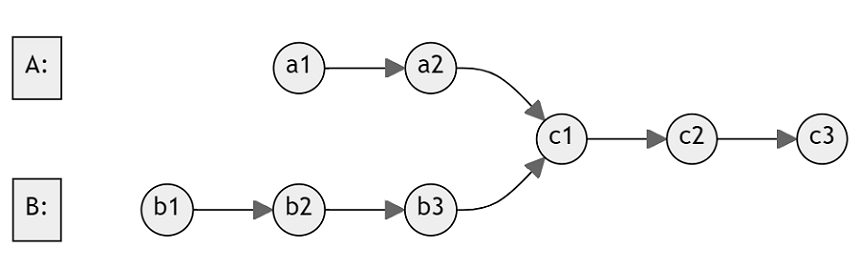
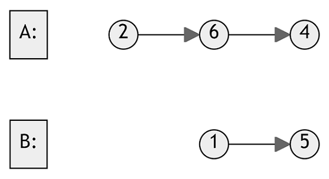

# Intersection of Two Linked Lists
% Easy 
## Problem statement

[^url]You are provided with the starting nodes of two singly linked lists, `headA` and `headB`. Your task is to find the node where these two lists intersect. If there is no point of intersection, return `null`. 

For example, the following two linked lists begin to intersect at node `c1`:



Note that the linked lists do not have any cycles, and you must ensure that the original structure of the linked lists remains unchanged after solving this problem.

[^url]: https://leetcode.com/problems/intersection-of-two-linked-lists/ 
### Example 1

```text
Input: listA = [4,1,8,4,5], listB = [5,6,1,8,4,5].
Output: Intersected at '8'
```

### Example 2

```text
Input: listA = [1,9,1,2,4], listB = [3,2,4]
Output: Intersected at '2'
```

### Example 3

```text
Input: listA = [2,6,4], listB = [1,5]
Output: No intersection.
``` 

### Constraints

* The number of nodes of `listA` is in the `m`.
* The number of nodes of `listB` is in the `n`.
* `1 <= m, n <= 3 * 10^4`.
* `1 <= Node.val <= 10^5`. 

### Follow up
* Could you write a solution that runs in `O(m + n)` time and use only `O(1)` memory?

## Solution 1: Store the nodes

You can store all nodes of `listA` then iterate `listB` to determine which node is the intersection. If none is found, the two lists have no intersection.

### Example 1
* Store all nodes of `listA = [4,1,8,4,5]` in a map.
* Iterate `listB` and found node `'8'` was stored.
* Return `'8'`.

### Code

```cpp
#include <iostream>
#include <unordered_map>
using namespace std;
struct ListNode {
    int val;
    ListNode *next;
    ListNode(int x) : val(x), next(NULL) {}
};

ListNode *getIntersectionNode(ListNode *headA, ListNode *headB) {
    unordered_map<ListNode*, bool> m;
    ListNode *node = headA;
    while (node != nullptr) {
        m[node] = true;
        node = node->next;
    }
    node = headB;
    while (node != nullptr) {
        if (m.find(node) != m.end()) {
            return node;
        }
        node = node->next;
    }
    return nullptr;
}
int main() {
    {   // Example 1
        ListNode five(5);
        ListNode four(4);
        four.next = &five;
        ListNode eight(8);
        eight.next = &four;

        ListNode one1(1);
        one1.next = &eight;
        ListNode four1(4);
        four1.next = &one1;

        ListNode one2(1);
        one2.next = &eight;
        ListNode six2(6);
        six2.next = &one2;
        ListNode five2(5);
        five2.next = &six2;
        cout << (getIntersectionNode(&four1, &five2) == &eight) << endl;
    }
    {   // Example 2
        ListNode four(4);
        ListNode two(2);
        two.next = &four;

        ListNode one12(1);
        one12.next = &two;
        ListNode nine1(9);
        nine1.next = &one12;
        ListNode one11(1);
        one11.next = &nine1;

        ListNode three2(3);
        three2.next = &two;
        cout << (getIntersectionNode(&one11, &three2) == &two) << endl;
    }
    {   // Example 3
        ListNode four(4);
        ListNode six(6);
        six.next = &four;
        ListNode two(2);
        two.next = &six;

        ListNode five(5);
        ListNode one(1);
        one.next = &five;
        cout << (getIntersectionNode(&two, &one) == nullptr) << endl;
    }
}
```
```text
Output:
1
1
1
```
This code uses an unordered map to store the nodes of `headA` while traversing it. Then, it traverses `headB` and checks if each node in `headB` exists in the map of nodes from `headA`. If a common node is found, it returns that node as the intersection point; otherwise, it returns `nullptr` to indicate no intersection. 

### Complexity
* Runtime: `O(m + n)`, where `m`, `n` are the number of nodes of `listA` and `listB`.
* Extra space: `O(m)`.

## Solution 2: Reiterating the two lists at the same time

If the two lists do not share the same tail, they have no intersection. Otherwise, they must intersect at some node.

After iterating to find the tail node, you know the length of the two lists. That information gives you a hint of how to reiterate to find the intersection node. 

### Example 1
* After iterating `listA = [4,1,8,4,5]`, you find the tail node is `'5'` and `listA.length = 5`. 
* After iterating `listB = [5,6,1,8,4,5]`, you find the tail node is the last `'5'` and `listB.length = 6`.
* The two lists share the same tail. They must intersect at some node.
* To find that intersection node, you have to reiterate the two lists.
* Since `listB.length = 6 > 5 = listA.length`, you can start iterating `listB` first until the number of its remaining nodes is the same as `listA`. In this case, it is the node `'6'` of `listB`.
* Now you can iterate them at the same time to find which node is shared.
* Found and return the intersection node `'8'`.

### Code
```cpp
#include <iostream>
#include <unordered_map>
using namespace std;
struct ListNode {
    int val;
    ListNode *next;
    ListNode(int x) : val(x), next(NULL) {}
};
ListNode *getIntersectionNode(ListNode *headA, ListNode *headB) 
{
    int lengthA = 0;
    ListNode *nodeA = headA;
    while (nodeA->next != nullptr) {
        lengthA++;
        nodeA = nodeA->next;
    }
    int lengthB = 0;
    ListNode *nodeB = headB;
    while (nodeB->next != nullptr) {
        lengthB++;
        nodeB = nodeB->next;
    }
    if (nodeA != nodeB) {
        return nullptr;
    }
    nodeA = headA;
    nodeB = headB;
    while (lengthA > lengthB) {
        nodeA = nodeA->next;
        lengthA--;
    }
    while (lengthB > lengthA) {
        nodeB = nodeB->next;
        lengthB--;
    }
    while (nodeA != nodeB) {
        nodeA = nodeA->next;
        nodeB = nodeB->next;
    }
    return nodeA;
}
int main() {
    {   // Example 1
        ListNode five(5);
        ListNode four(4);
        four.next = &five;
        ListNode eight(8);
        eight.next = &four;

        ListNode one1(1);
        one1.next = &eight;
        ListNode four1(4);
        four1.next = &one1;

        ListNode one2(1);
        one2.next = &eight;
        ListNode six2(6);
        six2.next = &one2;
        ListNode five2(5);
        five2.next = &six2;
        cout << (getIntersectionNode(&four1, &five2) == &eight) << endl;
    }
    {   // Example 2
        ListNode four(4);
        ListNode two(2);
        two.next = &four;

        ListNode one12(1);
        one12.next = &two;
        ListNode nine1(9);
        nine1.next = &one12;
        ListNode one11(1);
        one11.next = &nine1;

        ListNode three2(3);
        three2.next = &two;
        cout << (getIntersectionNode(&one11, &three2) == &two) << endl;
    }
    {   // Example 3
        ListNode four(4);
        ListNode six(6);
        six.next = &four;
        ListNode two(2);
        two.next = &six;

        ListNode five(5);
        ListNode one(1);
        one.next = &five;
        cout << (getIntersectionNode(&two, &one) == nullptr) << endl;
    }
}
```
```text
Output:
1
1
1
```

This improved solution finds the intersection of two linked lists by first determining their lengths and adjusting the pointers so that they start from the same relative position to the intersection point. Then, it iterates through both linked lists until it finds the common intersection node. 

### Complexity

* Runtime: `O(m + n)`, where `m`, `n` are the number of nodes of `listA` and `listB`.
* Extra space: `O(1)`.


```{admonition} Implementation tip
:class: tip
The technique used in Solution 2 is known as the *Two-pointer* technique since you use two pointers to iterate the list at the same time.
```

## Exercise
- [Minimum Index Sum of Two Lists](https://leetcode.com/problems/minimum-index-sum-of-two-lists/)