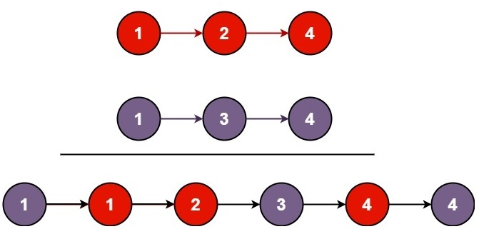

# Merge Two Sorted Lists

% Easy

## Problem statement

[^url]Given the starting nodes of two sorted linked lists, `list1` and `list2`, your task is to combine these lists into a single sorted linked list. 

This merged list should be created by connecting the nodes from both `list1` and `list2`. Finally, you should return the starting node of the resulting merged linked list.

[^url]: https://leetcode.com/problems/merge-two-sorted-lists/
### Example 1

```text
Input: list1 = [1,2,4], list2 = [1,3,4]
Output: [1,1,2,3,4,4]
```

### Example 2
```text
Input: list1 = [], list2 = []
Output: []
```

### Example 3

```text
Input: list1 = [], list2 = [0]
Output: [0]
``` 

### Constraints

* The number of nodes in both lists is in the range `[0, 50]`.
* `-100 <= Node.val <= 100`.
* Both `list1` and `list2` are sorted in non-decreasing order.

## Solution: Constructing a new list

For each pair of nodes between the two lists, pick the node having smaller value to append to the new list.

### Code
```cpp
#include <iostream>
struct ListNode {
    int val;
    ListNode *next;
    ListNode() : val(0), next(nullptr) {}
    ListNode(int x) : val(x), next(nullptr) {}
    ListNode(int x, ListNode *next) : val(x), next(next) {}
};
 
ListNode* mergeTwoLists(ListNode* list1, ListNode* list2) {
    if (list1 == nullptr) {
        return list2;
    } else if (list2 == nullptr) {
        return list1;
    }
    // identify which list is head
    ListNode* head = list1;
    if (list2->val < head->val) {
        head = list2;
        list2 = list2->next;
    } else {
        list1 = list1->next;
    }
    ListNode* node = head;
    while (list1 && list2) {
        if (list1->val < list2->val) {
            node->next = list1;
            list1 = list1->next;
        } else {
            node->next = list2;
            list2 = list2->next;
        }
        node = node->next;
    }
    if (list1 == nullptr) {
        node->next = list2;
    } else {
        node->next = list1;
    }
    return head;
}
void printResult(ListNode* head) {
    std::cout << "[";
    while (head) {
        std::cout << head->val << ",";
        head = head->next;
    }
    std::cout << "]\n";
}
int main() {   
    ListNode four1(4);
    ListNode two1(2, &four1);
    ListNode one1(1, &two1);
    ListNode four2(4);
    ListNode three2(3, &four2);
    ListNode one2(1, &three2);
    auto newOne = mergeTwoLists(&one1, &one2);
    printResult(newOne);

    auto empty = mergeTwoLists(nullptr, nullptr);
    printResult(empty);

    ListNode zero(0);
    auto z = mergeTwoLists(nullptr, &zero);
    printResult(z);
}
```
```text
Output:
[1,1,2,3,4,4,]
[]
[0,]
```

This solution merges two sorted linked lists efficiently without using extra space. 

It identifies the head of the merged list by comparing the values of the first nodes of the input lists. Then, it iterates through both lists, linking nodes in ascending order until one list is exhausted. 

Finally, it appends the remaining nodes from the non-empty list to the merged list, ensuring the resulting list remains sorted.

### Complexity
* Runtime: `O(N)`, where `N = list1.length + list2.length`.
* Extra space: `O(1)`.
