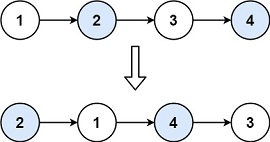
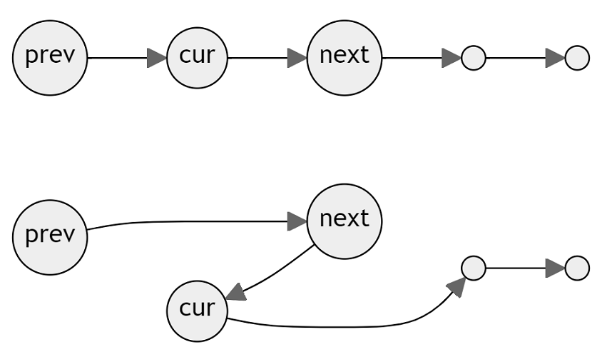

# Swap Nodes in Pairs

## [Problem statement](https://leetcode.com/problems/swap-nodes-in-pairs/)

You are provided with a linked list. Your goal is to exchange every two adjacent nodes in the list and then return the head of the modified list. 

You must solve this problem without altering the values within the nodes; you should only modify the arrangement of the nodes themselves. 


### Example 1

```text
Input: head = [1,2,3,4]
Output: [2,1,4,3]
```

### Example 2
```text
Input: head = []
Output: []
```
### Example 3
```text
Input: head = [1]
Output: [1]
``` 

### Constraints

* The number of nodes in the list is in the range `[0, 100]`.
* `0 <= Node.val <= 100`.

## Solution

Draw a picture of the swapping to identify the correct order of the update.



Denote `(cur, next)` the pair of nodes you want to swap and `prev` be the previous node that links to `cur`. Here are the steps you need to perform for the swapping.
1. Update the links between nodes.
2. Go to the next pair. 

### Code
```cpp
#include <iostream>
struct ListNode {
    int val;
    ListNode *next;
    ListNode() : val(0), next(nullptr) {}
    ListNode(int x) : val(x), next(nullptr) {}
    ListNode(int x, ListNode *next) : val(x), next(next) {}
};
ListNode* swapPairs(ListNode* head) {
    // the list does not have enough nodes to swap
    if (head == nullptr || head->next == nullptr) {
        return head;
    }
    ListNode* preNode = nullptr;
    ListNode* curNode = head; 
    ListNode* nextNode = head->next;  
    head = nextNode;
    while (curNode != nullptr && nextNode != nullptr) {

        // swap curNode and nextNode
        curNode->next = nextNode->next;
        nextNode->next = curNode;

        // update links/pointers after swap
        if (preNode) {
            preNode->next = nextNode;
        }

        // update nodes for next step
        preNode = curNode;
        curNode = curNode->next;       
        if (curNode) {
            nextNode = curNode->next;
        }
    }
    return head;
}
void print(const ListNode* head) {
    ListNode* node = head;
    std::cout << "[";
    while (node != nullptr) {
        std::cout << node->val << ",";
        node = node->next;
    }
    std::cout << "]" << std::endl;
}
int main() {
    ListNode four(4);
    ListNode three(3, &four);
    ListNode two(2, &three);
    ListNode one(1, &two);    
    print(swapPairs(&one));
    ListNode five(5);
    print(swapPairs(nullptr));
    print(swapPairs(&five));
}
```
```text
Output:
[2,1,4,3,]
[]
[5,]
```

### Complexity
* Runtime: `O(N)`, where `N` is the number of nodes.
* Extra space: `O(1)`.

## Conclusion

This solution swaps pairs of nodes in a linked list by adjusting the pointers accordingly. 

It initializes pointers to the current node (`curNode`), its next node (`nextNode`), and the previous node (`preNode`). Then, it iterates through the list, swapping pairs of nodes by adjusting their `next` pointers and updating the `preNode` pointer. 

This approach efficiently swaps adjacent nodes in the list without requiring additional space, effectively transforming the list by rearranging pointers.

## Exercise
- [Swapping Nodes in a Linked List](https://leetcode.com/problems/swapping-nodes-in-a-linked-list/).

