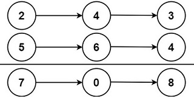

# Add Two Numbers
% Medium
## Problem statement

[^url]You have two linked lists that represent non-negative integers. The digits of these numbers are stored in reverse order, with each node containing a single digit. 

Your task is to add the two numbers represented by these linked lists and return the result as a new linked list. 

You can assume that the two numbers don't have leading zeros, except for the number 0 itself.

[^url]: https://leetcode.com/problems/add-two-numbers/
### Example 1

```text
Input: l1 = [2,4,3], l2 = [5,6,4]
Output: [7,0,8]
Explanation: 342 + 465 = 807.
```

### Example 2
```text
Input: l1 = [0], l2 = [0]
Output: [0]
```

### Example 3
```text
Input: l1 = [9,9,9,9,9,9,9], l2 = [9,9,9,9]
Output: [8,9,9,9,0,0,0,1]
```

### Constraints

* The number of nodes in each linked list is in the range `[1, 100]`.
* `0 <= Node.val <= 9`.
* It is guaranteed that the list represents a number that does not have leading zeros.

## Solution: Addition With Remember
Perform the school addition calculation and store the result in one of the lists. 

Without loss of generality, let us store the result in `l1`. Then you might need to extend it when `l2` is longer than `l1` and when the result requires one additional node (Example 3).

### Code
```cpp
#include <iostream>
struct ListNode {
    int val;
    ListNode *next;
    ListNode() : val(0), next(nullptr) {}
    ListNode(int x) : val(x), next(nullptr) {}
    ListNode(int x, ListNode *next) : val(x), next(next) {}
};

ListNode* addTwoNumbers(ListNode* l1, ListNode* l2) {
    // dummy node to hook the head of the list
    ListNode prehead;
    
    // let's use l1's nodes to store result
    ListNode* node = l1;  
    prehead.next = node;
    int sum = 0;
    while (node) {

        // perform the addition
        if (l1) {
            sum += l1->val;
            l1 = l1->next;
        }
        if (l2) {
            sum += l2->val;
            l2 = l2->next;
        }
        node->val = sum % 10;

        // keep track the carry
        sum /= 10;
        if (!l1) {      // l1 ends        
            if (l2) {   // l1 is shorter than l2
                node->next = l2;
            } else if (sum == 1) {  
                // both l1 and l2 end but the remember is not zero 
                ListNode* newNode = new ListNode(sum);
                node->next = newNode;
            }
        }
        node = node->next;
    }
    return prehead.next;
}
void printResult(ListNode* l) {
    std::cout << "[";
    while (l) {
        std::cout << l->val << ",";
        l = l->next;
    }
    std::cout << "]\n";
}
int main() {
    {
        ListNode three(3);
        ListNode four1(4, &three);
        ListNode two(2, &four1);
        ListNode four2(4);
        ListNode six(6, &four2);
        ListNode five(5, &six);
        printResult(addTwoNumbers(&two, &five));
    }
    {
        ListNode zero1(0);
        ListNode zero2(0);
        printResult(addTwoNumbers(&zero1, &zero2));
    }
    {
        ListNode nine0(9);
        ListNode nine1(9, &nine0);
        ListNode nine2(9, &nine1);
        ListNode nine3(9, &nine2);
        ListNode nine4(9, &nine3);
        ListNode nine5(9, &nine4);
        ListNode nine6(9, &nine5);
        ListNode nine7(9);
        ListNode nine8(9, &nine7);
        ListNode nine9(9, &nine8);
        ListNode nine10(9, &nine9);
        printResult(addTwoNumbers(&nine6, &nine10));
    }
}
```
```text
Output:
[7,0,8,]
[0,]
[8,9,9,9,0,0,0,1,]
```

This solution leverages a dummy node (`prehead`) to simplify the handling of edge cases and to hook the head of the resulting list. 

By iterating through both input lists simultaneously and performing addition digit by digit while keeping track of carry, it efficiently computes the sum without the need for additional checks for the head of the resulting list. 

This approach streamlines the addition process, resulting in a concise and straightforward implementation.

### Complexity

* Runtime: `O(N)`, where `N = max(l1.length, l2.length)`.
* Extra space: `O(1)`.

## Exercise
- [Double a Number Represented as a Linked List](https://leetcode.com/problems/double-a-number-represented-as-a-linked-list/)