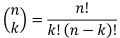
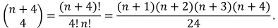

# Count Sorted Vowel Strings

## [Problem statement](https://leetcode.com/problems/count-sorted-vowel-strings/)

Given an integer `n`, return the number of strings of length `n` that consist only of vowels (`a`, `e`, `i`, `o`, `u`) and are lexicographically sorted.

A string `s` is lexicographically sorted if for all valid `i`, `s[i]` is the same as or comes before `s[i+1]` in the alphabet.

 

### Example 1
```text
Input: n = 1
Output: 5
Explanation: The 5 sorted strings that consist of vowels only are ["a","e","i","o","u"].
```

### Example 2
```text
Input: n = 2
Output: 15
Explanation: The 15 sorted strings that consist of vowels only are
["aa","ae","ai","ao","au","ee","ei","eo","eu","ii","io","iu","oo","ou","uu"].
Note that "ea" is not a valid string since 'e' comes after 'a' in the alphabet.
```

### Example 3
```text
Input: n = 33
Output: 66045
``` 

### Constraints

* `1 <= n <= 50`. 

## Solution 1: Finding the pattern

Let us find the relationship of the strings between the vowels.

### Example 3
For `n = 3`:

* There is (always) only one string starting from `u`, which is `uuu`.
* There are 3 strings starting from `o`: `ooo`, `oou` and `ouu`.
* There are 6 strings starting from `i`: `iii`, `iio`, `iiu`, `ioo`, `iou`, `iuu`.
* There are 10 strings starting from `e`: `eee`, `eei`, `eeo`, `eeu`, `eii`, `eio`, `eiu`, `eoo`, `eou`, `euu`.
* There are 15 strings starting from `a`: `aaa`, `aae`, `aai`, `aao`, `aau`, `aee`, `aei`, `aeo`, `aeu`, `aii`, `aio`, `aiu`, `aoo`, `aou`, `auu`.
* In total: there are 35 strings that satisfy the problem.

### Findings
In Example 3, if you ignore the leading vowel of those strings, then the shorted strings of the line above all appear in the ones of the line below and the remaining strings of the line below come from `n = 2`.
 
More precisely:

* All the shorted strings `oo`, `ou` and `uu` starting from `o` appear on the ones starting from `i`. The remaining `ii`, `io`, `iu` starting from `i` come from the strings of length `n = 2` (see Example 2).
* Similarly, all shorted strings `ii`, `io`, `iu`, `oo`, `ou`, `uu` starting from `i` appear on the ones starting from `e`. The remaining `ee`, `ei`, `eo`, `eu` come from `n = 2`.
* And so on.

That leads to the following recursive relationship.

Let `S(x, n)` be the number of strings of length `n` starting from a vowel `x`.  Then

* `S('o', n) = S('o', n - 1) + S('u', n)` for all `n > 1`.
* `S('i', n) = S('i', n - 1) + S('o', n)` for all `n > 1`.
* `S('e', n) = S('e', n - 1) + S('i', n)` for all `n > 1`.
* `S('a', n) = S('a', n - 1) + S('e', n)` for all `n > 1`.
* `S(x, 1) = 1` for all vowels `x`.
* `S('u', n) = 1` for all `n >= 1`.

For this problem, you want to compute 
```text
S(n) = S('a', n) + S('e', n) + S('i', n) + S('o', n) + S('u', n).
```

### Code
```cpp
#include <iostream>
using namespace std;
int countVowelStrings(int n) {
    int a, e, i, o, u;
    a = e = i = o = u = 1;
    while (n > 1) {
        o += u;
        i += o;
        e += i;
        a += e;
        n--;
    }
    return a + e + i + o + u;
}
int main() {
    cout << countVowelStrings(1) << endl;
    cout << countVowelStrings(2) << endl;
    cout << countVowelStrings(33) << endl;
}
```
```text
Output:
5
15
66045
```

### Complexity
* Runtime: `O(n)`.
* Extra space: `O(1)`.

## Solution 2: The math behind the problem 

The strings of length `n` you want to count are formed by a number of `'a'`, then some number of `'e'`, then some number of  `'i'`, then some number of `'o'` and finally some number of `'u'`. 

So it looks like this
```text
s = "aa..aee..eii..ioo..ouu..u".
```
And you want to count how many possibilities of such strings of length `n`.

One way to count it is using combinatorics in mathematics. 

If you separate the groups of vowels by `'|'` like this 

```text
s = "aa..a|ee..e|ii..i|oo..o|uu..u",
```
the problem becomes counting how many ways of putting those 4 separators `'|'` to form a string of length `n + 4`. 


In combinatorics, the solution is `(n + 4 choose 4)`, where `(n choose k)` is the [binomial coefficient](https://en.wikipedia.org/wiki/Binomial_coefficient):



The final number of strings is



$$
z=\sqrt{x^2+y^2}
$$

### Code
```cpp
#include <iostream>
using namespace std;
int countVowelStrings(int n) {    
    return (n + 1) * (n + 2) * (n + 3) * (n + 4) / 24;
}
int main() {
    cout << countVowelStrings(1) << endl;
    cout << countVowelStrings(2) << endl;
    cout << countVowelStrings(33) << endl;
}
```
```text
Output:
5
15
66045
```

### Complexity
* Runtime: `O(1)`.
* Extra space: `O(1)`.


