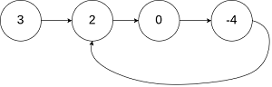
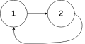

# Linked List Cycle

## [Problem statement](https://leetcode.com/problems/linked-list-cycle/)

Given `head`, the head of a linked list, determine if the linked list has a cycle in it.

Return `true` if there is a cycle in the linked list. Otherwise, return `false`.

 

### Example 1

```text
Input: head = [3,2,0,-4], where -4 links next to 2.
Output: true
```

### Example 2

```text
Input: head = [1,2], where 2 links next to 1.
Output: true
```

### Example 3

```text
Input: head = [1], and 1 links to NULL.
Output: false
Explanation: There is no cycle in this linked list.
``` 

### Constraints

* The number of the nodes in the list is in the range `[0, 10^4]`.
* `-10^5 <= Node.val <= 10^5`.
 

**Follow up:** Can you solve it using `O(1)` (i.e. constant) memory?

## Solution 1: Storing the visited nodes

### Code
```cpp
#include <unordered_map>
#include <iostream>
struct ListNode {
    int val;
    ListNode *next;
    ListNode(int x) : val(x), next(NULL) {}
};
bool hasCycle(ListNode *head) {
    std::unordered_map<ListNode*, int> m;
    while (head) {
        if (m[head] > 0) {
            return true;
        }
        m[head]++;
        head = head->next;
    }
    return false;
}
int main() {
    {
        ListNode three(3);
        ListNode two(2);
        three.next = &two;
        ListNode zero(0);
        two.next = &zero;
        ListNode four(4);
        zero.next = &four;
        four.next = &two;
        std::cout << hasCycle(&three) << std::endl;
    }
    {
        ListNode one(1);
        ListNode two(2);
        one.next = &two;
        two.next = &one;
        std::cout << hasCycle(&one) << std::endl;
    }
    {
        ListNode one(1);
        std::cout << hasCycle(&one) << std::endl;
    }
}
```
```text
Output:
1
1
0
```

### Code explanation

This solution is designed to detect the presence of a cycle in a linked list using a hash map to keep track of visited nodes. Here's a short explanation of how it works:

1. An unordered map `m` is used to store nodes as keys and their corresponding count of occurrences as values. This map will help in identifying whether a cycle exists in the linked list.

2. The function starts traversing the linked list from the `head` node.

3. In each iteration, it checks if the current `head` node exists in the map `m`. If it does, that means the same node has been encountered before, and there is a cycle in the linked list. In this case, the function returns `true`.

4. If the current `head` node is not found in the map (i.e., it's encountered for the first time), it's added to the map with a count of 1.

5. The `head` pointer is then moved to the next node in the list, and the process continues until either a cycle is detected (in which case the function returns `true`) or the end of the list is reached (in which case the function returns `false`).

### Complexity
This solution has a time complexity of `O(N)`, where `N` is the number of nodes in the linked list. In the worst case, it needs to traverse the entire linked list to detect a cycle. The space complexity is also `O(N)` because, in the worst case, it stores `N` nodes in the hash map.

* Runtime: `O(N)`, where `N` is the length of the linked list.
* Extra space: `O(N)`.

## Solution 2: Fast and slow runners
Imagine there are two runners both start to run along the linked list from the `head`. One runs twice faster than the other. 

If the linked list has a cycle in it, they will meet at some point. Otherwise, they never meet each other.

### Example 1
The slower runs `[3,2,0,-4,2,0,...]` while the faster runs `[3,0,2,-4,0,2,...]`. They meet each other at node `-4` after three steps.

### Example 2
The slower runs `[1,2,1,2,...]` while the faster runs `[1,1,1,...]`. They meet each other at node `1` after two steps.

### Code
```cpp
#include <iostream>
struct ListNode {
    int val;
    ListNode *next;
    ListNode(int x) : val(x), next(NULL) {}
};
bool hasCycle(ListNode *head) {
    if (head == nullptr) {
        return false;
    }
    ListNode* fast = head;
    ListNode* slow = head;    
    while (fast && fast->next) {
        fast = fast->next->next;
        slow = slow->next;
        if (fast == slow) {
            return true;
        }
    }
    return false;
}
int main() {
    {
        ListNode three(3);
        ListNode two(2);
        three.next = &two;
        ListNode zero(0);
        two.next = &zero;
        ListNode four(4);
        zero.next = &four;
        four.next = &two;
        std::cout << hasCycle(&three) << std::endl;
    }
    {
        ListNode one(1);
        ListNode two(2);
        one.next = &two;
        two.next = &one;
        std::cout << hasCycle(&one) << std::endl;
    }
    {
        ListNode one(1);
        std::cout << hasCycle(&one) << std::endl;
    }
}
```
```text
Output:
1
1
0
```
### Code explanation

This solution is designed to determine whether a linked list has a cycle efficiently using a two-pointer approach. Here's a brief explanation of how it works:

1. The function first checks if the `head` of the linked list is a null pointer. If the list is empty (i.e., `head` is null), it immediately returns `false` because an empty list cannot have a cycle.

2. Two pointers, `fast` and `slow`, are initialized to the `head` of the linked list. These pointers will traverse the list at different speeds to detect a cycle.

3. In a loop, both `fast` and `slow` move through the list. `fast` advances by two nodes at a time, while `slow` advances by one node at a time.

4. If there is no cycle in the list, `fast` will eventually reach the end of the list (i.e., it will become null), and the loop will terminate. In this case, the function returns `false`.

5. If a cycle exists, `fast` and `slow` will eventually meet or "overlap" within the cycle. This is because `fast` is moving twice as fast as `slow`, and it will eventually "catch up" to `slow` as they move around the cycle. When `fast` and `slow` meet, the loop detects the cycle and returns `true`.


### Complexity
This solution is highly efficient with a time complexity of `O(N)`, where `N` is the number of nodes in the linked list. The space complexity is `O(1)` because it uses a constant amount of extra space, regardless of the size of the linked list. It achieves cycle detection without using additional data structures, making it an optimal solution for this problem.

* Runtime: `O(N)`.
* Extra space: `O(1)`.


