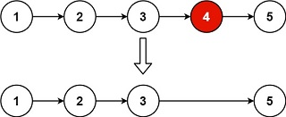

# Remove Nth Node From End of List

## [Problem statement](https://leetcode.com/problems/remove-nth-node-from-end-of-list/)
Given the `head` of a linked list, remove the `n-th` node from the end of the list and return its head.


### Example 1

```text
Input: head = [1,2,3,4,5], n = 2
Output: [1,2,3,5]
```

### Example 2
```text
Input: head = [1], n = 1
Output: []
```

### Example 3
```text
Input: head = [1,2], n = 1
Output: [1]
``` 

### Constraints

* The number of nodes in the list is `sz`.
* `1 <= sz <= 30`.
* `0 <= Node.val <= 100`.
* `1 <= n <= sz`.
 

**Follow up**: Could you do this in one pass?

## Solution 1: Store the nodes

### Code
```cpp
#include <iostream>
#include <vector>
struct ListNode {
    int val;
    ListNode *next;
    ListNode() : val(0), next(nullptr) {}
    ListNode(int x) : val(x), next(nullptr) {}
    ListNode(int x, ListNode *next) : val(x), next(next) {}
};
using namespace std;
ListNode* removeNthFromEnd(ListNode* head, int n) {
    vector<ListNode*> nodes;
    ListNode* node = head;
    while (node)
    {
        nodes.push_back(node);
        node = node->next;
    }
    node = nodes[nodes.size() - n];
    if (node == head) {
        head = node->next;
    } else {
        ListNode* pre = nodes[nodes.size() - n - 1];
        pre->next = node->next;
    }
    return head;
}
void printList(ListNode *head) {
    ListNode* node = head;
    cout << "[";
    while (node) {
        cout << node->val << ",";
        node = node->next;
    }
    cout << "]\n";
}
int main() {
    ListNode five(5);
    ListNode four(4, &five);
    ListNode three(3, &four);
    ListNode two(2, &three);
    ListNode one(1, &two);
    auto head = removeNthFromEnd(&one, 2);
    printList(head);
    head = removeNthFromEnd(&five, 1);
    printList(head);
    head = removeNthFromEnd(&four, 1);
    printList(head);
}
```
```text
Output:
[1,2,3,5,]
[]
[4,]
```

### Code explanation

This solution aims to remove the `n`-th node from the end of a singly linked list. It does so by first traversing the entire list to store the list nodes in a vector for easy access, then identifying and removing the desired node. Here's a short explanation of how it works:

1. The given linked list is represented by the `head` pointer, which points to the first node in the list.

2. The solution uses a vector called `nodes` to temporarily store all the list nodes. This vector will help in easily accessing the nodes required to perform the removal operation.

3. A pointer `node` is initialized and set to the `head` of the linked list. The algorithm iterates through the linked list by following the `next` pointers, adding each node to the `nodes` vector. This loop effectively traverses the entire linked list.

4. After completing the loop, the `node` pointer points to the `n`-th node from the end of the linked list. This is achieved by accessing the node at index `nodes.size() - n` in the `nodes` vector.

5. The algorithm checks whether the node to be removed is the first node in the linked list (i.e., it's the `head`). If it is, the `head` pointer is updated to point to the next node, effectively removing the first node.

6. If the node to be removed is not the first node, the algorithm accesses the previous node (the node before the one to be removed) by using the `nodes` vector. It updates the `next` pointer of the previous node to skip the node to be removed.

7. Finally, the modified linked list (with the `n`-th node removed) is returned by returning the `head` pointer.


### Complexity
This solution has a time complexity of `O(N)`, where `N` is the number of nodes in the linked list. This is because it needs to traverse the entire linked list once to create the `nodes` vector. The space complexity is also `O(N)` since it uses additional space to store the nodes in the vector.

* Runtime: `O(N)`, where `N` is the number of nodes in the list.
* Extra space: `O(N)`.

## Solution 2: Two pointers

The distance between the removed node and the end (`nullptr`) of the list is always `n`.

You can apply the two-pointer technique as follows.

Let the slower runner start after the faster one `n` nodes. Then when the faster reaches the end of the list, the slower reaches the node to be removed.

### Code
```cpp
#include <iostream>
#include <vector>
struct ListNode {
    int val;
    ListNode *next;
    ListNode() : val(0), next(nullptr) {}
    ListNode(int x) : val(x), next(nullptr) {}
    ListNode(int x, ListNode *next) : val(x), next(next) {}
};
using namespace std;
ListNode* removeNthFromEnd(ListNode* head, int n) {
    ListNode* fast = head;
    for (int i = 0; i < n; i++) {
        fast = fast->next;
    }
    if (fast == nullptr) {
        return head->next;
    }
    ListNode* slow = head;
    while (fast->next)
    {
        slow = slow->next;
        fast = fast->next;
    }
    slow->next = slow->next->next;
    return head;
}
void printList(ListNode *head) {
    ListNode* node = head;
    cout << "[";
    while (node) {
        cout << node->val << ",";
        node = node->next;
    }
    cout << "]\n";
}
int main() {
    ListNode five(5);
    ListNode four(4, &five);
    ListNode three(3, &four);
    ListNode two(2, &three);
    ListNode one(1, &two);
    auto head = removeNthFromEnd(&one, 2);
    printList(head);
    head = removeNthFromEnd(&five, 1);
    printList(head);
    head = removeNthFromEnd(&four, 1);
    printList(head);
}
```
```text
Output:
[1,2,3,5,]
[]
[4,]
```

### Code explanation

This solution removes the `n`-th node from the end of a singly linked list using a two-pointer approach. Here's a short explanation of how it works:

1. Two pointers, `fast` and `slow`, are initialized to the `head` of the linked list. These pointers will be used to identify the `n`-th node from the end and the previous node before it.

2. The `fast` pointer is moved `n` nodes ahead by running a loop. This effectively creates a gap of `n` nodes between the `fast` and `slow` pointers. If the `fast` pointer reaches the end of the list (i.e., becomes `nullptr`) before reaching `n` nodes ahead, it means that `n` is greater than or equal to the length of the list. In this case, the function returns the `head->next`, which removes the first node from the list (if `n` equals the length of the list).

3. If the `fast` pointer hasn't reached the end of the list, it means there are at least `n` nodes in the list. The `fast` pointer is now `n` nodes ahead of the `slow` pointer.

4. A second loop is initiated, where both the `fast` and `slow` pointers move one node at a time until the `fast` pointer reaches the end of the list. This effectively advances both pointers together, maintaining the gap of `n` nodes between them.

5. When the `fast` pointer reaches the end of the list (i.e., `fast->next` becomes `nullptr`), the `slow` pointer will be pointing to the node just before the `n`-th node from the end.

6. To remove the `n`-th node, the `slow->next` pointer is updated to skip the `n`-th node, effectively removing it from the list.

7. Finally, the modified linked list (with the `n`-th node removed) is returned by returning the `head` pointer.

### Complexity
This solution has a time complexity of `O(N)`, where `N` is the number of nodes in the linked list. It traverses the linked list twice but does so in a single pass. The space complexity is `O(1)` because it uses a constant amount of additional space, regardless of the size of the linked list.

* Runtime: `O(N)`, where `N` is the number of nodes in the list.
* Extra space: `O(1)`.


