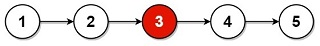

# Middle of the Linked List

## [Problem statement](https://leetcode.com/problems/middle-of-the-linked-list/)
Given the `head` of a singly linked list, return *the middle node of the linked list*.

If there are two middle nodes, return *the second middle* node.

### Example 1

```text
Input: head = [1,2,3,4,5]
Output: [3,4,5]
Explanation: The middle node of the list is node 3.
```

### Example 2

```text
Input: head = [1,2,3,4,5,6]
Output: [4,5,6]
Explanation: Since the list has two middle nodes with values 3 and 4, we return the second one.
```

### Constraints
* The number of nodes in the list is in the range `[1, 100]`.
* `1 <= Node.val <= 100`.

## Solution 1: Counting the number of nodes

### Code
```cpp
#include <iostream>
struct ListNode 
{
    int val;
    ListNode *next;
    ListNode() : val(0), next(nullptr) {}
    ListNode(int x) : val(x), next(nullptr) {}
    ListNode(int x, ListNode *next) : val(x), next(next) {}
};
ListNode* middleNode(ListNode* head) 
{
    ListNode *node = head;
    int count = 0;
    while (node) 
    {
        count++;
        node = node->next;
    }
    int i = 1;
    node = head;
    while (i <= count/2) 
    {
        node = node->next;
        i++;
    }
    return node;        
}
void print(ListNode *head) 
{
    ListNode *node = head; 
    std::cout << "[";
    while (node) 
    {
        std::cout << node->val << ",";
        node = node->next;
    }
    std::cout << "]\n";
}
int main() 
{
    ListNode five(5);
    ListNode four(4, &five);
    ListNode three(3, &four);    
    ListNode two(2, &three);
    ListNode one(1, &two);
    auto result = middleNode(&one);
    print(result);

    ListNode six(6);
    five.next = &six;
    result = middleNode(&one);
    print(result);
}
```
```text
Output:
[3,4,5,]
[4,5,6,]
```

### Code explanation

1. The code initialize a `node` pointer to the `head` of the linked list and a `count` variable to 0. These will be used to traverse the list and count the number of nodes.

2. It traverses the linked list using a `while` loop. In each iteration, it increments the `count` variable by 1 and moves the `node` pointer to the next node (`node = node->next`).

3. After the first loop, you have the total count of nodes in the linked list stored in the `count` variable.

4. The code initializes an integer variable `i` to 1 and resets the `node` pointer to the `head` of the linked list.

5. It starts a second `while` loop that runs until `i` is less than or equal to `count/2`. In each iteration, it increments `i` by 1 and moves the `node` pointer to the next node (`node = node->next`). This loop effectively moves the `node` pointer to the middle node of the linked list.

6. Finally, it returns the `node` pointer, which now points to the middle node of the linked list.

### Complexity
This solution first counts the total number of nodes in the linked list, and then it iterates to the middle node using the `count` variable. It has a time complexity of `O(N)`, where `N` is the number of nodes in the linked list, as it performs two passes through the list. The space complexity is `O(1)` because it uses a constant amount of additional space regardless of the size of the linked list.

* Runtime: `O(N)`.
* Extra space: `O(1)`.

## Solution 2: {index}`Fast and Slow` pointers
Use two pointers to go through the linked list. 

One goes one step at a time. The other goes two steps at a time. When the faster reaches the end, the slower reaches the middle.

### Code
```cpp
#include <iostream>
struct ListNode 
{
    int val;
    ListNode *next;
    ListNode() : val(0), next(nullptr) {}
    ListNode(int x) : val(x), next(nullptr) {}
    ListNode(int x, ListNode *next) : val(x), next(next) {}
};
ListNode* middleNode(ListNode* head) 
{
    ListNode *slow = head;
    ListNode *fast = head;
    while (fast && fast->next) 
    {
        slow = slow->next;
        fast = fast->next->next;
    }
    return slow;        
}
void print(ListNode *head) 
{
    ListNode *node = head; 
    std::cout << "[";
    while (node) 
    {
        std::cout << node->val << ",";
        node = node->next;
    }
    std::cout << "]\n";
}
int main() 
{
    ListNode five(5);
    ListNode four(4, &five);
    ListNode three(3, &four);    
    ListNode two(2, &three);
    ListNode one(1, &two);
    auto result = middleNode(&one);
    print(result);

    ListNode six(6);
    five.next = &six;
    result = middleNode(&one);
    print(result);
}
```
```text
Output:
[3,4,5,]
[4,5,6,]
```

### Code explanation

This solution finds the middle node of a singly linked list using a two-pointer approach (slow and fast pointers). Here's a brief explanation of how it works:

1. The code initializes two pointers, `slow` and `fast`, both initially pointing to the `head` of the linked list.

2. It uses a `while` loop to traverse the linked list. In each iteration, it moves the `slow` pointer one step forward (by `slow = slow->next`) and the `fast` pointer two steps forward (by `fast = fast->next->next`).

3. The code continues this process until the `fast` pointer reaches the end of the linked list (i.e., `fast` becomes `nullptr`) or the node just before the end (in case of an even-length list). At this point, the `slow` pointer will be exactly at the middle node of the linked list.

4. Finally, it returns the `slow` pointer, which now points to the middle node of the linked list.

### Complexity
This solution effectively finds the middle node in a single pass through the linked list, making it more efficient than the previous solution. It has a time complexity of `O(N)`, where `N` is the number of nodes in the linked list, and a space complexity of `O(1)` since it uses only two pointers regardless of the list's size.

* Runtime: `O(N)`.
* Extra space: `O(1)`.

## OBS!
* The approach using slow and fast pointers looks very nice and faster. But it is not suitable to generalize this problem to any relative position (one-third, a quarter, etc.). Moreover, long expressions like `fast->next->...->next` are not recommended. 
* Though the counting nodes approach does not seem optimized, it is more readable, scalable and maintainable.
