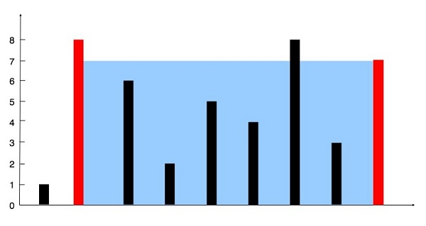

# Container With Most Water
% Medium
## Problem statement

[^url]You are given an integer array `height` of length `n`. There are `n` vertical lines drawn such that the two endpoints of the `i-th` line are `(i, 0)` and `(i, height[i])`.

Find two lines that together with the x-axis form a container, such that the container contains the most water.

Return the maximum amount of water a container can store.

Notice that you may not slant the container.

[^url]: https://leetcode.com/problems/container-with-most-water/

### Example 1



```text
Input: height = [1,8,6,2,5,4,8,3,7]
Output: 49
Explanation: The above vertical lines are represented by array [1,8,6,2,5,4,8,3,7]. In this case, the max area of water (blue/grey section) the container can contain is 49.
```

### Example 2
```text
Input: height = [1,1]
Output: 1
``` 

### Constraints

* `n == height.length`.
* `2 <= n <= 10^5`.
* `0 <= height[i] <= 10^4`.

## Solution 1: Bruteforce

For each line `i`, find the line `j > i` such that it gives the maximum amount of water the container `(i, j)` can store.

### Code

```cpp
#include <iostream>
#include <vector>
using namespace std;
int maxArea(vector<int>& height) {
    int maxA = 0;
    for (int i = 0; i < height.size() - 1; i++) {
        for (int j = i + 1; j < height.size(); j++) {
            maxA = max(maxA, min(height[i], height[j]) * (j - i));
        }
    }
    return maxA;
}
int main() {
    vector<int> height{1,8,6,2,5,4,8,3,7};
    cout << maxArea(height) << endl;
    height = {1,1};
    cout << maxArea(height) << endl;
}
```
```text
Output:
49
1
```

This solution computes the maximum area of water that can be trapped between two vertical lines by iterating through all possible pairs of lines. 
By considering all combinations of lines and calculating the area using the formula `(min(height[i], height[j]) * (j - i))`, where `height[i]` and `height[j]` represent the heights of the two lines and `(j - i)` represents the width between them, it effectively evaluates the area formed by each pair and updates `maxA` with the maximum area encountered. 

This approach optimizes the computation by exhaustively considering all possible pairs of lines and efficiently computing the area without requiring additional space.

### Complexity

* Runtime: `O(n^2)`, where `n = height.length`. This is because it checks all possible pairs of vertical lines, resulting in a quadratic time complexity.
* Extra space: `O(1)`.

## Solution 2: Two pointers

Any container has left line `i` and right line `j` satisfying `0 <= i < j < height.length`. The biggest container you want to find satisfies that condition too.

You can start from the broadest container with the left line `i = 0` and the right line `j = height.length - 1`. Then by moving `i` forward and `j` backward, you can narrow down the container to find which one will give the maximum amount of water it can store.

Depending on which line is higher, you can decide which one to move next. Since you want a bigger container, you should move the shorter line.

### Example 1
For `height = [1,8,6,2,5,4,8,3,7]`:
- Starting with `i = 0` and `j = 8`.

    ```text
    area = min(height[i], height[j]) * (j - i) = min(1, 7) * (8 - 0) = 8.
    maxArea = 8.
    ```
- `height[i] = 1 < 7 = height[j]`, move `i` to `1`.

    ```text
    area = min(8, 7) * (8 - 1) = 49.
    maxArea = 49.
    ```
- `height[i] = 8 > 7 = height[j]`, move `j` to `7`.

    ```text
    area = min(8, 3) * (7 - 1) = 18.
    maxArea = 49.
    ```
- So on and so on. Final `maxArea = 49`.

### Code

```cpp
#include <iostream>
#include <vector>
using namespace std;
int maxArea(vector<int>& height) {
    int maxA = 0;
    int i = 0;
    int j = height.size() - 1;
    while (i < j) {
        if (height[i] < height[j]) {
            maxA = max(maxA, height[i] * (j - i) );
            i++;
        } else {
            maxA = max(maxA, height[j] * (j - i) );
            j--;
        }
    }
    return maxA;
}
int main() {
    vector<int> height{1,8,6,2,5,4,8,3,7};
    cout << maxArea(height) << endl;
    height = {1,1};
    cout << maxArea(height) << endl;
}
```
```text
Output:
49
1
```

This solution is the two-pointer approach to compute the maximum area of water that can be trapped between two vertical lines. 

By initializing two pointers `i` and `j` at the beginning and end of the array respectively, and iteratively moving them towards each other until they converge, it evaluates all possible pairs of lines. 

At each step, it calculates the area using the formula `(min(height[i], height[j]) * (j - i))`, where `height[i]` and `height[j]` represent the heights of the two lines and `(j - i)` represents the width between them. By moving the pointer corresponding to the shorter line inward at each step, it ensures that the maximum possible area is considered. 

This approach optimizes the computation by avoiding redundant calculations and efficiently exploring the solution space using two pointers.

### Complexity

* Runtime: `O(n)`, where `n = height.length`.
* Extra space: `O(1)`.
