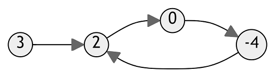
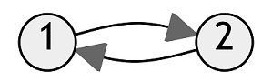

# Linked List Cycle
% Easy
## Problem statement

[^url]Given `head`, the head of a linked list, determine if the linked list has a cycle in it.

Return `true` if there is a cycle in the linked list. Otherwise, return `false`.

[^url]: https://leetcode.com/problems/linked-list-cycle/

### Example 1

```text
Input: head = [3,2,0,-4], where -4 links next to 2.
Output: true
```

### Example 2

```text
Input: head = [1,2], where 2 links next to 1.
Output: true
```

### Example 3

```text
Input: head = [1], and 1 links to NULL.
Output: false
Explanation: There is no cycle in this linked list.
``` 

### Constraints

* The number of the nodes in the list is in the range `[0, 10^4]`.
* `-10^5 <= Node.val <= 10^5`.
 

### Follow up
* Can you solve it using `O(1)` (i.e. constant) memory?

## Solution 1: Storing the visited nodes

### Code
```cpp
#include <unordered_map>
#include <iostream>
struct ListNode {
    int val;
    ListNode *next;
    ListNode(int x) : val(x), next(NULL) {}
};
bool hasCycle(ListNode *head) {
    std::unordered_map<ListNode*, bool> m;
    while (head) {
        if (m[head]) {
            // found this node marked in the map
            return true;
        }
        m[head] = true; // mark this node visited
        head = head->next;
    }
    return false;
}
int main() {
    {
        ListNode three(3);
        ListNode two(2);
        three.next = &two;
        ListNode zero(0);
        two.next = &zero;
        ListNode four(4);
        zero.next = &four;
        four.next = &two;
        std::cout << hasCycle(&three) << std::endl;
    }
    {
        ListNode one(1);
        ListNode two(2);
        one.next = &two;
        two.next = &one;
        std::cout << hasCycle(&one) << std::endl;
    }
    {
        ListNode one(1);
        std::cout << hasCycle(&one) << std::endl;
    }
}
```
```text
Output:
1
1
0
```

This solution uses a hash map to track visited nodes while traversing the linked list. 

By iterating through the linked list and marking pointers to visited nodes in the hash map, it detects cycles in the linked list. If a node is found marked `true` in the map, it indicates the presence of a cycle, and the function returns `true`. Otherwise, if the end of the linked list is reached without finding any node marked, it confirms the absence of a cycle, and the function returns `false`. 

This approach optimizes the computation by leveraging the hash map to efficiently detect cycles in the linked list without requiring additional space proportional to the length of the list.

### Complexity

* Runtime: `O(N)`, where `N` is the length of the linked list.
* Extra space: `O(N)`.

## Solution 2: {index}`Fast and Slow` runners
Imagine there are two runners both start to run along the linked list from the `head`. One runs twice faster than the other. 

If the linked list has a cycle in it, they will meet at some point. Otherwise, they never meet each other.

### Example 1
The slower runs `[3,2,0,-4,2,0,...]` while the faster runs `[3,0,2,-4,0,2,...]`. They meet each other at node `-4` after three steps.

### Example 2
The slower runs `[1,2,1,2,...]` while the faster runs `[1,1,1,...]`. They meet each other at node `1` after two steps.

### Code
```cpp
#include <iostream>
struct ListNode {
    int val;
    ListNode *next;
    ListNode(int x) : val(x), next(NULL) {}
};
bool hasCycle(ListNode *head) {
    if (head == nullptr) {
        return false;
    }
    ListNode* fast = head;
    ListNode* slow = head;    
    while (fast && fast->next) {
        fast = fast->next->next;
        slow = slow->next;
        if (fast == slow) {
            return true;
        }
    }
    return false;
}
int main() {
    {
        ListNode three(3);
        ListNode two(2);
        three.next = &two;
        ListNode zero(0);
        two.next = &zero;
        ListNode four(4);
        zero.next = &four;
        four.next = &two;
        std::cout << hasCycle(&three) << std::endl;
    }
    {
        ListNode one(1);
        ListNode two(2);
        one.next = &two;
        two.next = &one;
        std::cout << hasCycle(&one) << std::endl;
    }
    {
        ListNode one(1);
        std::cout << hasCycle(&one) << std::endl;
    }
}
```
```text
Output:
1
1
0
```

### Complexity

* Runtime: `O(N)`, where `N` is the number of nodes in the linked list.
* Extra space: `O(1)`.

## Key Takeaway

Solution 2 uses two pointers, a fast pointer and a slow pointer, to detect cycles in a linked list. 

Both pointers start from the head of the list, and the fast pointer moves two steps forward while the slow pointer moves one step forward in each iteration. By comparing the positions of the fast and slow pointers, the algorithm detects cycles in the linked list. 

If the fast pointer catches up with the slow pointer at any point during traversal, it indicates the presence of a cycle, and the function returns `true`. Otherwise, if the fast pointer reaches the end of the list without intersecting with the slow pointer, it confirms the absence of a cycle, and the function returns `false`. 

This approach optimizes the computation by simultaneously advancing two pointers at different speeds to efficiently detect cycles in the linked list.

## Exercise
- [Linked List Cycle II](https://leetcode.com/problems/linked-list-cycle-ii/)
