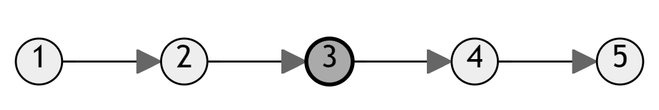

# Middle of the Linked List
% Easy 
## Problem statement
[^url]Given the `head` of a singly linked list, return *the middle node of the linked list*.

If there are two middle nodes, return *the second middle* node.

[^url]: https://leetcode.com/problems/middle-of-the-linked-list/

### Example 1

```text
Input: head = [1,2,3,4,5]
Output: [3,4,5]
Explanation: The middle node of the list is node 3.
```

### Example 2

```text
Input: head = [1,2,3,4,5,6]
Output: [4,5,6]
Explanation: Since the list has two middle nodes with values 3 and 4, we return the second one.
```

### Constraints
* The number of nodes in the list is in the range `[1, 100]`.
* `1 <= Node.val <= 100`.

## Solution 1: Counting the number of nodes

### Code
```cpp
#include <iostream>
struct ListNode {
    int val;
    ListNode *next;
    ListNode() : val(0), next(nullptr) {}
    ListNode(int x) : val(x), next(nullptr) {}
    ListNode(int x, ListNode *next) : val(x), next(next) {}
};
ListNode* middleNode(ListNode* head) {
    ListNode *node = head;
    int count = 0;
    while (node) {
        count++;
        node = node->next;
    }
    int i = 1;
    node = head;
    while (i <= count/2) {
        node = node->next;
        i++;
    }
    return node;        
}
void print(const ListNode *head) {
    ListNode *node = head; 
    std::cout << "[";
    while (node) {
        std::cout << node->val << ",";
        node = node->next;
    }
    std::cout << "]\n";
}
int main() {
    ListNode five(5);
    ListNode four(4, &five);
    ListNode three(3, &four);    
    ListNode two(2, &three);
    ListNode one(1, &two);
    auto result = middleNode(&one);
    print(result);

    ListNode six(6);
    five.next = &six;
    result = middleNode(&one);
    print(result);
}
```
```text
Output:
[3,4,5,]
[4,5,6,]
```

This solution first counts the total number of nodes in the linked list, and then it iterates to the middle node using the `count` variable. 

### Complexity

* Runtime: `O(N)`, where `N` is the number of nodes in the linked list.
* Extra space: `O(1)`.

## Solution 2: {index}`Fast and Slow` pointers
Use two pointers to go through the linked list. 

One goes one step at a time. The other goes two steps at a time. When the faster reaches the end, the slower reaches the middle.

### Code
```cpp
#include <iostream>
struct ListNode {
    int val;
    ListNode *next;
    ListNode() : val(0), next(nullptr) {}
    ListNode(int x) : val(x), next(nullptr) {}
    ListNode(int x, ListNode *next) : val(x), next(next) {}
};
ListNode* middleNode(ListNode* head) {
    ListNode *slow = head;
    ListNode *fast = head;
    while (fast && fast->next) {
        slow = slow->next;
        fast = fast->next->next;
    }
    return slow;        
}
void print(const ListNode *head) {
    ListNode *node = head; 
    std::cout << "[";
    while (node) {
        std::cout << node->val << ",";
        node = node->next;
    }
    std::cout << "]\n";
}
int main() {
    ListNode five(5);
    ListNode four(4, &five);
    ListNode three(3, &four);    
    ListNode two(2, &three);
    ListNode one(1, &two);
    auto result = middleNode(&one);
    print(result);

    ListNode six(6);
    five.next = &six;
    result = middleNode(&one);
    print(result);
}
```
```text
Output:
[3,4,5,]
[4,5,6,]
```

This solution uses two pointers, a slow pointer and a fast pointer, to find the middle node of a linked list. Both pointers start from the head of the list, and in each iteration, the slow pointer moves one step forward while the fast pointer moves two steps forward. This ensures that the slow pointer reaches the middle node of the list when the fast pointer reaches the end. 

By advancing the pointers at different speeds, the algorithm identifies the middle node of the linked list. If the list has an odd number of nodes, the slow pointer will be positioned at the middle node. If the list has an even number of nodes, the slow pointer will be positioned at the node closer to the middle of the list. 

Finally, the algorithm returns the slow pointer, which points to the middle node of the linked list. 

This approach optimizes the computation by traversing the linked list only once and using two pointers to efficiently locate the middle node.

### Complexity

* Runtime: `O(N)`, where `N` is the number of nodes in the linked list.
* Extra space: `O(1)`.

## OBS!
* The approach using slow and fast pointers looks very nice and faster. But it is not suitable to generalize this problem to any relative position (one-third, a quarter, etc.). Moreover, long expressions like `fast->next->...->next` are not recommended. 
* Though the counting nodes approach does not seem optimized, it is more readable, scalable and maintainable.

## Exercise
- Delete the Middle Node of a Linked List[^ex].

[^ex]: https://leetcode.com/problems/delete-the-middle-node-of-a-linked-list/